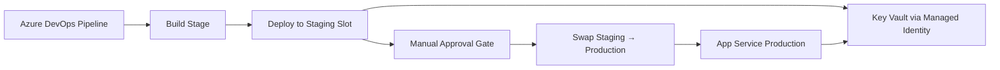

# App Service + Managed Identity + Deployment Slots + Azure DevOps

A portal-first lab covering Azure App Service deployment with System-Assigned Managed Identity, deployment slots for blue-green deployments, Key Vault secret integration, and a full Azure DevOps CI/CD pipeline with manual approval gates.

## Track Structure

```text
App Service + Managed Identity + Deployment Slots + Azure DevOps/
├── App Service + Managed Identity + Deployment Slots + Azure DevOps.md
└── README.md
```

## Lab Sequence

1. [App Service + Managed Identity + Deployment Slots + Azure DevOps](App%20Service%20%2B%20Managed%20Identity%20%2B%20Deployment%20Slots%20%2B%20Azure%20DevOps.md)

   | Section | What It Covers |
   | --- | --- |
   | 1. Prerequisites | Azure role, subscription, tools, and Key Vault requirements |
   | 2. Learning Objectives | Outcomes: identity, slots, Key Vault references, pipeline, approval gate |
   | 3. Scenario | Deploy a web app with zero secrets in code or pipelines |
   | 4. Lab Architecture | Resource map: pipeline → staging slot → Key Vault → production slot |
   | 5. Create the App Service | Portal walkthrough — resource group, plan (S1), and app creation |
   | 6. Create a Deployment Slot | Add `staging` slot; understand production vs. staging URLs |
   | 7. Enable Managed Identity | System-Assigned Managed Identity on both production and staging slots |
   | 8. Copy Object IDs | Retrieve the principal ID for each slot identity |
   | 9. Grant Key Vault Access | Assign **Key Vault Secrets User** RBAC role to both identities |
   | 10. Key Vault References | Add `@Microsoft.KeyVault(SecretUri=...)` app settings; validate green-check resolution |
   | 11. Azure DevOps Pipeline | Multi-stage YAML: Build → Deploy to Staging → Swap to Production |
   | 12. Test Slot Swap | Push a visible change, run the pipeline, validate staging then production |
   | 13. Manual Approval Gates | Create `production` environment, add approver, link to SwapToProduction stage |
   | 14. Cleanup / Teardown | Delete `rg-appservice-wus2-lab`; Key Vault removed separately |

## Scenario

**Deploy a web application with zero secrets in code or pipelines.**

The App Service reads secrets from Key Vault via Managed Identity. A CI/CD pipeline deploys to a staging slot first, and a manual approval gate controls the promotion to production. This is the standard enterprise deployment pattern for regulated environments.

## Architecture Logic

- Each deployment slot has its own System-Assigned Managed Identity in Microsoft Entra ID.
- Both identities are granted the **Key Vault Secrets User** RBAC role independently.
- Key Vault references resolve secrets at runtime — no credentials are stored in app settings or pipeline variables.
- A multi-stage Azure DevOps YAML pipeline orchestrates Build → Staging → Production with a manual approval checkpoint.



## Prerequisites

- Azure subscription with **Owner** or **Contributor** role on the target subscription
- An existing Key Vault with at least one secret (e.g., `app-secret`)
- Azure Portal access
- Azure DevOps organization at `dev.azure.com`
- Estimated time: 60–90 minutes

## Key Concepts Covered

| Concept | Description |
| --- | --- |
| System-Assigned Managed Identity | Per-resource identity managed by Azure; each slot gets its own principal |
| Deployment Slots | Separate environments (staging/production) within a single App Service; requires S1 or higher SKU |
| Slot Swap | Atomic promotion of staging to production with zero downtime |
| Key Vault References | App settings that resolve secrets at runtime via `@Microsoft.KeyVault(SecretUri=...)` |
| Azure RBAC | **Key Vault Secrets User** role grants read-only secret access without vault access policies |
| Multi-Stage YAML Pipeline | Azure DevOps stages with `dependsOn` controlling deployment flow |
| Manual Approval Gate | Environment-level checkpoint that pauses the pipeline until an approver confirms |
| Secretless Architecture | No passwords or tokens in code, app settings, or pipeline variables |

---

[← Back to Azure Hands-On Engineering](../README.md)
