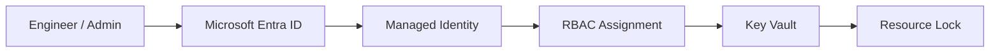
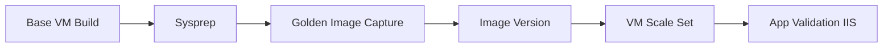
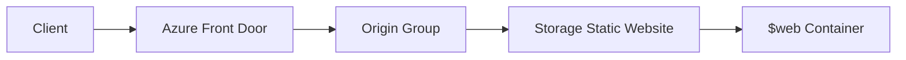
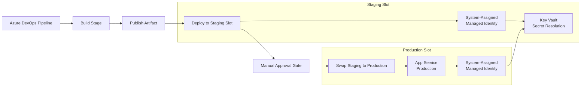
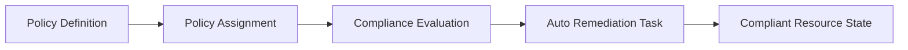
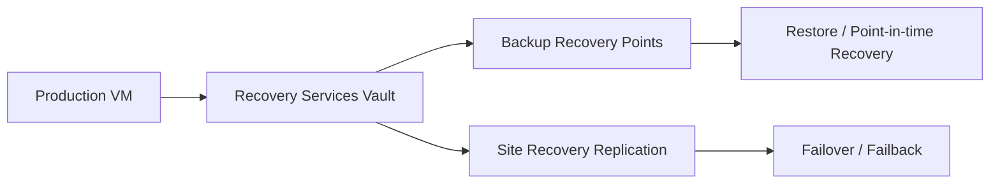
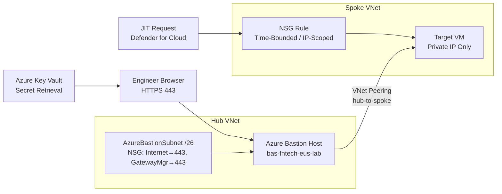
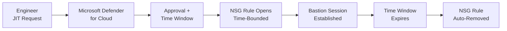
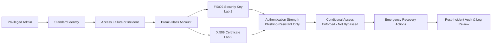

# Architecture Overview

## Identity Governance

Text flow: Engineer/Admin -> Microsoft Entra ID -> Managed Identity -> RBAC -> Key Vault -> Resource Lock.

### Compute Lifecycle

Text flow: Base VM Build -> Sysprep -> Golden Image -> Gallery Version -> VMSS -> Validation.

### Global Delivery

Text flow: Client -> Front Door -> Origin Group -> Storage Static Website -> $web content.

### App Service Delivery

Text flow: Azure DevOps Pipeline -> Build Stage -> Publish Artifact -> Deploy to Staging Slot (Managed Identity resolves Key Vault reference) -> Manual Approval Gate -> Swap Staging to Production -> App Service Production (Managed Identity resolves Key Vault reference). No secrets stored in code, app settings, or pipeline variables.

### Governance Automation

Text flow: Policy Definition -> Assignment -> Compliance Evaluation -> Auto-remediation -> Compliant state.

### Business Continuity

Text flow: Production VM -> Recovery Services Vault -> Backup/ASR -> Restore or Failover.

### Secure VM Access

Text flow: Engineer retrieves VM credentials from Key Vault (secretless auth) -> Engineer browser (HTTPS 443) connects to Azure Bastion public IP -> Bastion sits in AzureBastionSubnet /26 with required NSG rules -> VNet Peering (hub-to-spoke) -> Target VM (private IP only, no public IP). JIT opens a time-bounded, IP-scoped NSG rule on the VM before the session is established.

### JIT Access Lifecycle

Text flow: Engineer submits JIT request -> Defender for Cloud evaluates and approves -> Time-bounded NSG rule opens -> Engineer connects via Bastion -> Time window expires -> NSG rule auto-removed.

### Emergency Access

Text flow: Standard identity fails during incident -> Break-glass account (FIDO2 or CBA) -> Authentication Strength enforced by Conditional Access -> Emergency Recovery Actions -> Post-Incident Audit.

**Design note:** Both MFA methods are enforced by a dedicated Authentication Strength policy inside Conditional Access. Break-glass accounts are never excluded from CA — consistent with the Microsoft 2025 security baseline.

---

## Lab Tracks

| Track | Description |
| --- | --- |
| [Azure Bastion](./Azure%20Bastion/README.md) | Browser-based RDP/SSH with no public IP, NSG rules for Bastion subnet, Key Vault secretless auth, hub-spoke VNet Peering, troubleshooting guide |
| [Microsoft Defender for Cloud](./Microsoft%20Defender%20for%20Cloud/Readme.md) | Just-In-Time VM access, time-bounded IP-scoped NSG rules, zero standing access, audit trail |
| [Identity-First](./Identity-First/README.md) | Managed Identity, Key Vault, RBAC, Locks, Policy, Bicep |
| [App Service + Managed Identity + Deployment Slots + Azure DevOps](./App%20Service%20%2B%20Managed%20Identity%20%2B%20Deployment%20Slots%20%2B%20Azure%20DevOps/ReadME.md) | System-Assigned Managed Identity per slot, Key Vault references (secretless), deployment slots, multi-stage Azure DevOps YAML pipeline, manual approval gates |
| [Azure Policy Auto-Remediation](./Azure%20Policy%20Auto%E2%80%91Remediation/README.md) | Custom policy, DeployIfNotExists, remediation tasks |
| [Compute](./Compute/README.md) | Base VM build, Sysprep, IIS installation |
| [VMSS](./VMSS/README.md) | Golden image capture, Compute Gallery, scale set deployment |
| [Azure Front Door](./Azure%20Front%20Door-Static%20Website%20Hosting/README.md) | WAF, custom domains, static website origin, caching behaviour |
| [Recovery Services Vaults](./Recovery%20Services%20vaults/README.md) | VM backup, restore, ASR replication |
| [Break-Glass – FIDO2 (Lab 1)](./Secure%20Break%E2%80%91Glass%20Accounts/1-Secure%20Break%E2%80%91Glass%20Accounts.md) | Cloud-only emergency accounts with FIDO2 keys, Authentication Strength, CA enforcement |
| [Break-Glass – CBA (Lab 2)](./Secure%20Break%E2%80%91Glass%20Accounts/2-Certificate-Based%20Authentication%28CBA%29for%20Emergency%20Access%20Accounts.md) | Certificate-based authentication as phishing-resistant MFA for emergency access |
| [Microsoft Entra Backup & Recovery](./Microsoft%20Entra%20Backup%20%26%20Recovery/README.md) | Entra directory backup and object-level recovery |

[← Back to README](./README.md)
