# Architecture Overview

Last validated on: July 2026

## Identity Governance

The identity control plane uses a fully secretless chain — no hardcoded credentials flow through any resource. A User-Assigned Managed Identity is granted **Key Vault Secrets User** at resource scope via RBAC, and a Resource Lock on the Key Vault prevents accidental deletion. This pattern eliminates static credentials from all compute and automation workloads.

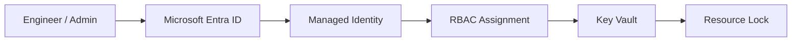

## Compute Lifecycle

VM images are built once and promoted through a quality gate before scaling. A base VM is provisioned and configured with IIS, then generalized with Sysprep to produce a golden image stored in Azure Compute Gallery. VM Scale Sets draw from that versioned image so every instance in the fleet is bit-identical and can be replaced without configuration drift.

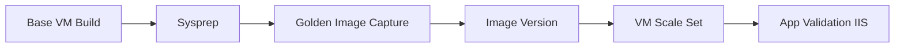

## Global Delivery

Static content is served from Azure Blob Storage (`$web` container) with Azure Front Door in front for global CDN, WAF, and custom domain/TLS termination. The origin group handles health probes and automatic failover; caching rules at the Front Door layer reduce origin load and improve latency for geographically distributed users.

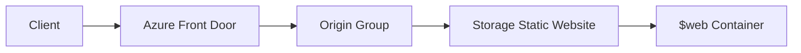

## App Service Delivery

A multi-stage Azure DevOps pipeline builds the artifact, deploys to a staging slot, and waits at a manual approval gate before swapping to production. Each slot holds its own System-Assigned Managed Identity with independent Key Vault access — secrets resolve at runtime and never appear in pipeline YAML or environment variables.

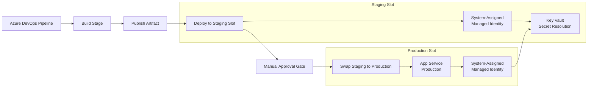

## Governance Automation

Policy definitions are assigned at subscription or management group scope and evaluated against all in-scope resources. Non-compliant resources trigger auto-remediation tasks via the **DeployIfNotExists** effect — closing the gap between policy intent and enforced resource state without manual intervention or ticket-driven remediation.

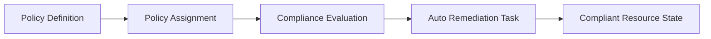

## Business Continuity

A Recovery Services Vault sits centrally across both backup and site recovery scenarios. Backup creates configurable recovery points for point-in-time restore; Azure Site Recovery replicates VMs to a secondary region and enables test, planned, and unplanned failover with near-zero RPO targets — all governed by a single vault policy.

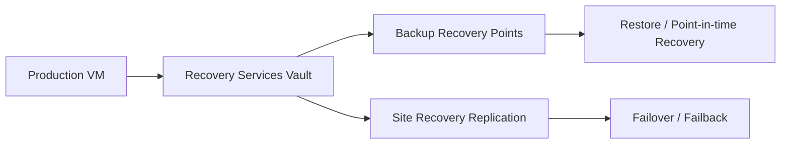

## Secure VM Access

No VM in this architecture carries a public IP. All RDP and SSH access is brokered through Azure Bastion, connecting over VNet Peering between hub and spoke VNets. Credentials are retrieved from Key Vault at session time; JIT policies layer on top to restrict NSG rules to a time-bounded, IP-scoped window — combining two independent zero-trust controls.

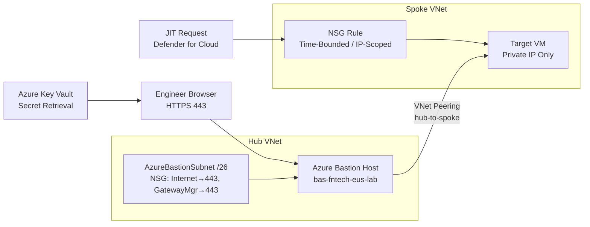

## JIT Access Lifecycle

Just-In-Time VM access integrates Defender for Cloud with NSG automation to eliminate standing inbound access. An engineer submits a scoped request; Defender evaluates it, opens a time-bounded NSG rule, and automatically removes it when the window expires. No manual cleanup is required — the attack surface returns to zero after every session.

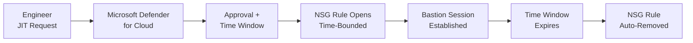

## Emergency Access

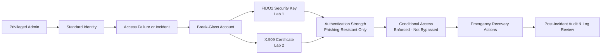

**Design note:** Both MFA methods are enforced by a dedicated Authentication Strength policy inside Conditional Access. Break-glass accounts are never excluded from CA — consistent with the Microsoft 2025 security baseline.

## Microsoft Entra Backup & Recovery

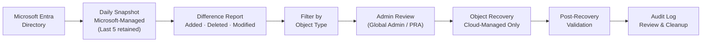

**Design note:** Recovery scope is limited to cloud-managed objects only — on-premises synchronized objects appear in difference reports but cannot be recovered through this service. Backup cadence and retention (5 daily snapshots) are Microsoft-managed and not configurable.

## Azure Arc Hybrid Server Architecture

Azure Arc extends the Azure control plane to servers running outside Azure — on-premises, in other clouds, or at the edge. The Connected Machine Agent projects each server as an Azure resource, enabling RBAC, Tags, Azure Monitor (via AMA + DCR), Defender for Cloud, Azure Policy/Guest Configuration, and Update Manager to apply uniformly across the entire hybrid estate without migrating workloads to Azure.

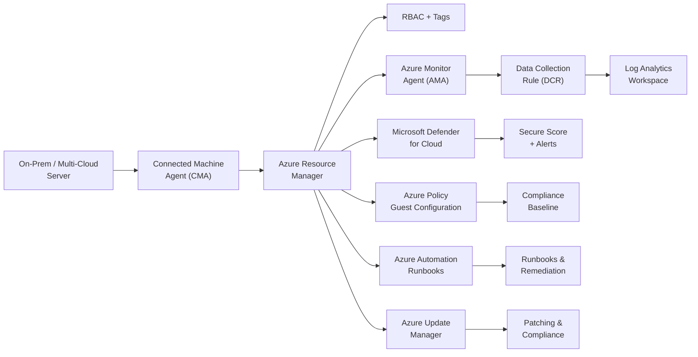

## Azure Update Manager

Azure Update Manager provides a unified, agent-free patch orchestration layer for both Azure VMs and Arc-enabled servers. Assessment scans surface available updates without installing anything; maintenance configurations gate when deployments are permitted; compliance reporting identifies overdue machines across the fleet without routing data through Log Analytics as a dependency.

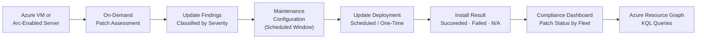

**Design note:** Agent-free for Azure VMs (uses the VM Agent already present) and Arc-enabled servers (uses the Connected Machine Agent installed during Arc onboarding). Dynamic scoping by subscription, resource group, or tag keeps fleet membership accurate automatically. Maintenance configurations gate deployment windows — updates cannot be installed outside the defined window, making patching change-controlled by design.

## Modern Workplace (Microsoft 365)

All Microsoft 365 workloads are gated behind a single Zero Trust Conditional Access policy enforcing device compliance and phishing-resistant MFA. Data flowing through Exchange, SharePoint, and Teams is captured by Microsoft Purview for DLP, auto-labeling, and audit. Identity Governance lifecycle workflows automate Joiner/Mover/Leaver processes and drive Access Reviews and Entitlement Management at scale.

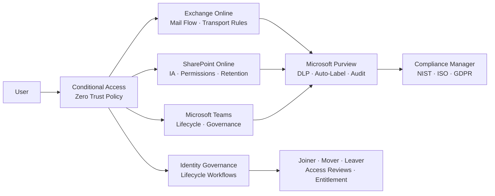

## Deploying a Domain Controller in Azure

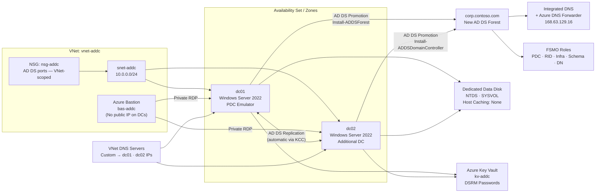

**Design note:** Domain controllers have no public IP — all administrative access is via Azure Bastion. Static private IPs are assigned before promotion to prevent DNS and replication failures after VM restarts. The VNet's DNS server setting is updated to the DC IPs after promotion so all workloads in the VNet automatically use the domain for name resolution. DSRM passwords are stored in Key Vault rather than local notes.

---

## Lab Tracks

| Track | Description |
| --- | --- |
| [Azure Bastion](./Azure%20Bastion/README.md) | Browser-based RDP/SSH with no public IP, NSG rules for Bastion subnet, Key Vault secretless auth, hub-spoke VNet Peering, troubleshooting guide |
| [Microsoft Defender for Cloud](./Microsoft%20Defender%20for%20Cloud/README.md) | Defender for Servers Plan 2: Secure Score, vulnerability assessment, File Integrity Monitoring, alert investigation, MDE integration · JIT VM access — time-bounded, IP-scoped NSG rules, zero standing access, audit trail |
| [Identity-First](./Identity-First/README.md) | Managed Identity, Key Vault, RBAC, Locks, Policy, Bicep |
| [Bicep](./Bicep/README.md) | Modular IaC: UAMI, Key Vault, RBAC, Resource Lock, Storage, VM, Diagnostics — composed via main.bicep |
| [App Service + Managed Identity + Deployment Slots + Azure DevOps](./App%20Service%20%2B%20Managed%20Identity%20%2B%20Deployment%20Slots%20%2B%20Azure%20DevOps/README.md) | System-Assigned Managed Identity per slot, Key Vault references (secretless), deployment slots, multi-stage Azure DevOps YAML pipeline, manual approval gates |
| [Azure Policy Auto-Remediation](./Azure%20Policy%20Auto%E2%80%91Remediation/README.md) | Custom policy, DeployIfNotExists, remediation tasks |
| [Compute](./Compute/README.md) | Base VM build, Sysprep, IIS installation |
| [VMSS](./VMSS/README.md) | Golden image capture, Compute Gallery, scale set deployment |
| [Azure Front Door](./Azure%20Front%20Door-Static%20Website%20Hosting/README.md) | WAF, custom domains, static website origin, caching behavior |
| [Recovery Services Vaults](./Recovery%20Services%20vaults/README.md) | VM backup, restore, ASR replication |
| [Break-Glass – FIDO2 (Lab 1)](./Secure%20Break%E2%80%91Glass%20Accounts/1-Secure%20Break%E2%80%91Glass%20Accounts.md) | Cloud-only emergency accounts with FIDO2 keys, Authentication Strength, CA enforcement |
| [Break-Glass – CBA (Lab 2)](./Secure%20Break%E2%80%91Glass%20Accounts/2-Certificate-Based%20Authentication%28CBA%29for%20Emergency%20Access%20Accounts.md) | Certificate-based authentication as phishing-resistant MFA for emergency access |
| [Microsoft Entra Backup & Recovery](./Microsoft%20Entra%20Backup%20%26%20Recovery/README.md) | Entra directory backup and object-level recovery |
| [Azure Arc Hybrid Server Architecture](./Azure%20Arc%20Hybrid%20Server%20Architecture/README.md) | Hybrid server landing zone: Arc projection, CMA onboarding, AMA + DCR monitoring, Policy/Guest Config compliance, Automation runbooks, lifecycle management, Hyper-V lab for Arc validation — dedicated tracks for [Defender for Cloud](./Microsoft%20Defender%20for%20Cloud/README.md) and [Update Manager](./Azure%20Update%20Manager/README.md) |
| [Azure Update Manager](./Azure%20Update%20Manager/README.md) | Patch assessment, maintenance configurations, scheduled and one-time update deployments, compliance dashboard — covers Azure VMs and Arc-enabled servers |
| [Deploying a Domain Controller in Azure](./Deploying%20a%20Domain%20Controller%20in%20Azure/1-DeployingDomain%20Controller%20in%20Azure.md) | Azure-hosted AD DS: VNet + Bastion (no public IPs), NSG with AD DS port rules, Availability Set, static private IPs, dedicated data disk (host caching: None), forest creation, second DC promotion, automatic replication, FSMO role distribution, Azure DNS forwarder, Key Vault for DSRM secrets |
| [Modern Workplace (Microsoft 365)](./Microsoft%20365/README.md) | Exchange Online advanced mail flow, SharePoint information architecture, Teams lifecycle governance, Purview compliance automation, Zero Trust Conditional Access, Identity Governance lifecycle workflows |

[← Back to Azure Hands-On Engineering](./README.md)
