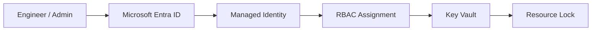
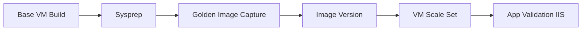
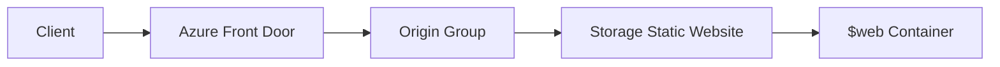
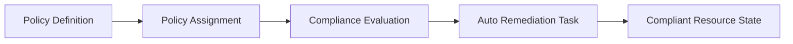
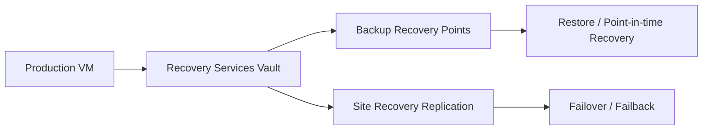
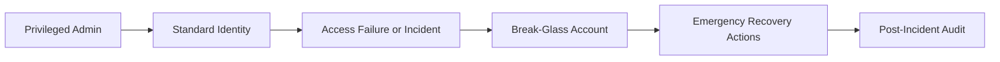

# Architecture Overview

## Identity Governance

Text flow: Engineer/Admin -> Microsoft Entra ID -> Managed Identity -> RBAC -> Key Vault -> Resource Lock.

### Compute Lifecycle

Text flow: Base VM Build -> Sysprep -> Golden Image -> Gallery Version -> VMSS -> Validation.

### Global Delivery

Text flow: Client -> Front Door -> Origin Group -> Storage Static Website -> $web content.

### Governance Automation

Text flow: Policy Definition -> Assignment -> Compliance Evaluation -> Auto-remediation -> Compliant state.

### Business Continuity

Text flow: Production VM -> Recovery Services Vault -> Backup/ASR -> Restore or Failover.

### Emergency Access

Text flow: Standard identity fails during incident -> Break-glass account -> Recovery actions -> Audit.

