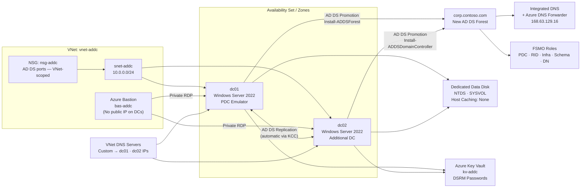

# Deploying a Domain Controller in Azure

Last validated on: 2026-07-06
Portal experience note: Steps validated against Azure Portal and PowerShell as of July 2026; labels can vary slightly by region and feature rollout.

> **Note:** This lab deploys a two-DC Active Directory Domain Services forest in Azure. All resources are self-contained in a single subscription and resource group. DSRM passwords and local admin credentials are stored in Azure Key Vault — no secrets are stored locally or in documentation.
> **Why this matters:** On-premises workloads migrating to Azure, hybrid identity scenarios, and applications that require Kerberos or NTLM authentication all depend on a healthy, highly available domain controller infrastructure. Deploying DCs in Azure — with no public IPs, Bastion-only access, static private IPs, and Key Vault-stored secrets — demonstrates the secure-by-default posture required in enterprise environments. This lab bridges traditional Active Directory engineering with Azure's identity and governance model.

## Module / Track Structure

```text
Deploying a Domain Controller in Azure/
├── 1-deploying-domain-controller-in-azure.md   ← this file
└── README.md
```

**Track context:** This lab complements the [Azure Bastion](../Azure%20Bastion/README.md) and [Identity-First](../Identity-First/README.md) tracks. Bastion provides secure access to the DCs; the Identity-First track covers cloud-only Managed Identity patterns that exist alongside (not instead of) AD DS.

## Quick Navigation

- [Scenario](#scenario)
- [Learning Objectives](#learning-objectives)
- [Prerequisites](#prerequisites)
- [1 — Create a Resource Group](#1-create-a-resource-group)
- [2 — Set Up Networking](#2-set-up-networking)
- [3 — Availability Set / Zones](#3-create-an-availability-set-or-availability-zones)
- [4 — Deploy Virtual Machines](#4-deploy-virtual-machines)
- [5 — Install AD DS Role](#5-install-active-directory-domain-services-ad-ds--both-vms)
- [6 — Promote First DC](#6-promote-the-first-vm-to-a-domain-controller)
- [7 — Promote Second DC](#7-promote-the-second-vm-as-an-additional-domain-controller)
- [8 — Secure the Environment](#8-secure-the-environment)
- [9 — Test and Monitor](#9-test-and-monitor)
- [10 — Troubleshooting](#10-errors-and-troubleshooting)

---

## Scenario

Your organization is migrating a line-of-business application to Azure IaaS. The application requires Kerberos authentication and Group Policy support, so a cloud-hosted AD DS forest is needed. You are tasked with deploying two highly available domain controllers with no public IP exposure, Bastion-only admin access, static private IPs, dedicated data disks with write-back caching disabled, and DSRM secrets stored in Azure Key Vault.

---

## Learning Objectives

By the end of this lab you will be able to:

- Design an Azure VNet topology for AD DS with a hardened NSG (all AD DS ports scoped to VNet, no public RDP)
- Deploy Azure Bastion as the sole administrative access path to domain controllers
- Configure static private IP addresses before DC promotion to prevent DNS and replication failures
- Add and configure a dedicated managed disk with host caching disabled for the NTDS database
- Promote a Windows Server 2022 VM to a new AD DS forest using `Install-ADDSForest`
- Promote a second VM as an additional DC using `Install-ADDSDomainController`
- Verify replication with `repadmin /replsummary` and `dcdiag`
- Distribute FSMO roles between two domain controllers
- Configure the VNet's custom DNS setting to use the DC IPs
- Store DSRM passwords in Azure Key Vault

---

## Prerequisites

| Requirement | Detail |
| --- | --- |
| Azure subscription | Contributor rights on the target resource group |
| Region | Any region supporting Availability Zones (recommended) |
| Compute quota | 2× `Standard_D2s_v5` (or equivalent general-purpose SKU) |
| OS image | Windows Server 2022 Datacenter (Azure Marketplace) |
| Tools | Azure Portal; elevated PowerShell (on the DC VMs via Bastion) |
| Key Vault | Pre-existing or created in Step 8 — used to store DSRM passwords |
| Estimated time | 90–120 minutes |

---

## Architecture



**Design note:** Domain controllers have no public IP — all administrative access is via Azure Bastion. Static private IPs are assigned before promotion to prevent DNS and replication failures after VM restarts. The VNet's DNS server setting is updated to the DC IPs after promotion so all workloads in the VNet automatically use the domain for name resolution. DSRM passwords are stored in Key Vault rather than local notes.

---

## Introduction

This lab deploys a two-domain-controller Active Directory Domain Services forest in Azure using the Azure Portal and PowerShell. All steps follow the secure-by-default pattern: no public IPs, Bastion-only access, static private IPs, host-caching disabled data disks, and secrets stored in Key Vault.

---

## 1. Create a Resource Group

Start by creating a resource group to organize your resources.

1. Sign in to the **Azure Portal**.
2. Click **Resource groups** in the left navigation pane → **+ Create**.
3. Provide the following details:
   - **Subscription:** Select your subscription.
   - **Resource group name:** Choose a unique name (e.g., `rg-addc-lab`).
   - **Region:** Select a region (e.g., "East US 2").
4. Click **Review + create**, then **Create**.

---

## 2. Set Up Networking

Create an Azure Virtual Network (VNet), a subnet, and secure access — these are three separate concerns, covered separately below.

### 2.1 Create a Virtual Network

1. Search for and select **Virtual networks** in the Azure Portal → **+ Create**.
2. On the **Basics** tab:
   - **Subscription:** Select your subscription.
   - **Resource group:** Use the resource group created in Step 1.
   - **Name:** Enter a name for your VNet (e.g., `vnet-addc`).
   - **Region:** Match the region used for the resource group.
3. On the **IP Addresses** tab, configure the default subnet:
   - **Name:** e.g., `subnet-addc`.
   - **IPv4 address range:** e.g., `10.0.0.0/16`.
   - **Subnet size:** e.g., `/24` (256 addresses) — plenty for two DCs plus headroom.
4. Click **Review + create**, then **Create**.

### 2.2 Secure Access — Use Azure Bastion, Not Public IPs

Domain controllers should **never** have a public IP address or an NSG rule opening RDP to the internet. Use Azure Bastion for all administrative access instead.

1. Search for and select **Bastion** → **+ Create**.
2. Set subscription, resource group, and name.
3. Select the VNet created above — Bastion will provision its own dedicated `AzureBastionSubnet` (minimum `/26`) inside it.
4. Click **Review + create**, then **Create**.
5. **Do not** assign a public IP to either domain controller VM later in this guide (see Step 4) — connect via **Bastion** using the VM's private IP only.

### 2.3 Network Security Group (NSG) — Correct Rules

Create an NSG and attach it to the DC subnet. Do **not** open RDP (3389) from the internet — Bastion handles admin access without needing that rule.

1. Search for and select **Network security groups** → **+ Create**.
2. Set subscription, resource group, name (e.g., `nsg-addc`), and region.
3. After creation, go to **Inbound security rules** and add rules to allow AD DS traffic **from the VNet address space only** (source: VNet or your specific subnet range, not "Any"):
| Port | Protocol | Purpose |
| --- | --- | --- |
| 53 | TCP/UDP | DNS |
| 88 | TCP/UDP | Kerberos |
| 135 | TCP | RPC Endpoint Mapper |
| 389 | TCP/UDP | LDAP |
| 445 | TCP | SMB (SYSVOL/NETLOGON access) |
| 464 | TCP/UDP | Kerberos password change |
| 636 | TCP | LDAPS |
| 3268 | TCP | Global Catalog |
| 3269 | TCP | Global Catalog over SSL |
| 49152–65535 | TCP | Dynamic RPC range (used by AD replication) |

4. Associate the NSG with the DC subnet: **Virtual network → Subnets → [subnet] → Network security group**.

   Note: traffic *within* the same VNet is allowed by the default `AllowVnetInBound` rule, so these explicit rules mainly matter if the DCs sit in different subnets/VNets (peered) or if you extend to an on-premises network via VPN/ExpressRoute — see 2.4.

### 2.4 (Optional) Extend to an On-Premises Network

Only needed if this domain needs to be reachable from an existing on-prem network — skip this section for a self-contained Azure-only lab or deployment.

1. Navigate to your Virtual Network → **Virtual network gateways** → **+ Add**.
2. Provide:
   - **Name:** Choose a unique name.
   - **Gateway type:** `VPN` or `ExpressRoute`, depending on requirements.
   - **VPN type:** Route-based (recommended) or Policy-based.
   - **SKU:** Basic, Standard, or HighPerformance depending on throughput needs.
   - **Virtual network:** The VNet created in 2.1.
   - **Public IP address:** Create a new one (this is for the *gateway*, not the DC VMs — a gateway public IP is expected and safe).
3. Click **Review + create**, then **Create**.
4. Configure the connection:
   - **Local network gateway:** on-premises IP range and BGP settings.
   - **Connection type:** Site-to-Site (IPsec) or ExpressRoute.
   - **Shared key:** set a strong pre-shared key.
5. If using a client VPN rather than site-to-site, download and install the VPN client configuration on the relevant on-premises devices.
6. Test connectivity from an on-prem host to the Azure VNet before proceeding, and monitor the gateway's connection status in the portal.

---

## 3. Create an Availability Set (or Availability Zones)

Distribute the two domain controllers so a single hardware or maintenance event can't take both down at once.

**Two options:**

- **Availability Set** — groups VMs across fault domains and update domains within a single datacenter. Provides a 99.95% SLA. Simpler, works in any region.
- **Availability Zones** — spreads VMs across physically separate datacenters within a region. Provides a 99.99% SLA and better resilience, but requires a region that supports Availability Zones and the VMs must be zone-pinned at creation (can't be added to a Set and Zone simultaneously).

**Recommendation:** use **Availability Zones** if your target region supports them; fall back to an Availability Set otherwise.

**To create an Availability Set:**

1. Click **Create a resource** → search **Availability Set**.
2. Configure name, resource group, number of fault domains, and number of update domains.
3. You'll select this Availability Set (or, alternatively, a specific Availability Zone) when creating each VM in Step 4.

---

## 4. Deploy Virtual Machines

Create two Azure VMs running Windows Server — use a currently supported version (**Windows Server 2022**; avoid Server 2016, which is nearing end of mainstream support and lacks several security defaults available in newer builds).

1. Click **Create a resource** → search **Virtual Machine**.
2. Configure:
   - **Subscription / Resource group:** as created above.
   - **Virtual Machine Name:** unique per VM (e.g., `dc01`, `dc02`).
   - **Region:** match your VNet.
   - **Image:** Windows Server 2022 Datacenter.
   - **Size:** a general-purpose size such as `Standard_D2s_v5` is sufficient for a domain controller at small-to-medium scale; scale up only if you expect heavy authentication load.
   - **Authentication:** set a strong admin username and password (avoid the literal name "Administrator" as the account name where possible).
   - **Networking:**
     - Virtual network / subnet created in Step 2.1.
     - **Public IP: None** — domain controllers must not have a public IP. Access is via Bastion only.
     - NSG: attach the NSG created in Step 2.3, or leave "None" here if it's already associated at the subnet level.
   - **Disks:** OS disk as default; you will add a dedicated data disk after creation (Step 4.1).
   - **Availability options:** select the Availability Set (or Availability Zone) from Step 3.
3. Complete the wizard for both VMs.

### 4.1 Add a Dedicated Data Disk for AD DS (both VMs)

Do **not** install the AD database, logs, or SYSVOL on the OS disk. Use a separate managed disk with host caching disabled — write-back caching can corrupt the AD database during unexpected restarts.

1. Go to each VM → **Disks** → **+ Create and attach a new disk**.
2. Size appropriately (e.g., 32–64 GB is generous for a small/medium domain).
3. Set **Host caching: None** — this is the critical setting; the default "Read/Write" caching is not safe for the NTDS database.
4. Save, then connect to the VM via Bastion and initialize/format the new disk. In an elevated PowerShell session:

   ```powershell
   # List disks to identify the new uninitialized disk (RAW, no partition)
   Get-Disk

   # Initialize, partition, and format (replace '1' with the correct disk number)
   Initialize-Disk -Number 1 -PartitionStyle GPT
   New-Partition -DiskNumber 1 -UseMaximumSize -DriveLetter F
   Format-Volume -DriveLetter F -FileSystem NTFS -NewFileSystemLabel "NTDS" -Confirm:$false
   ```

   You'll point AD DS at this volume (`F:`) during promotion in Step 6.

### 4.2 Configure a Static Private IP Address (both VMs)

Azure assigns dynamic private IPs by default. If a DC's IP changes after a reboot, DNS resolution and replication break. Set static IPs before promoting either VM.

1. Go to each VM → **Networking** → select the network interface → **IP configurations**.
2. Change **Assignment** from Dynamic to **Static**.
3. Note the assigned IP for each VM — you'll need both when configuring DNS client settings in Step 6.

---

## 5. Install Active Directory Domain Services (AD DS) — Both VMs

1. Connect to each VM via **Bastion** (not RDP over a public IP) using the private IP and the admin credentials set during VM creation.
2. Open **Server Manager** → **Add roles and features**.
3. Select **Active Directory Domain Services** and complete the wizard to install the role (do this on both VMs).
4. Reboot if prompted.

---

## 6. Promote the First VM to a Domain Controller

1. On the first VM (e.g., `dc01`), in **Server Manager**, click the notification flag → **Promote this server to a domain controller**.
   - Alternatively, in an elevated PowerShell session:

     ```powershell
     Install-ADDSForest `
       -DomainName "corp.lab.com" `  # replace with your preferred domain name
       -DomainNetbiosName "CORP" `
       -InstallDns:$true `
       -DatabasePath "F:\NTDS" `
       -LogPath "F:\NTDS" `
       -SysvolPath "F:\SYSVOL"
     ```

2. In the wizard, choose **Add a new forest** and specify a routable, unique domain name (avoid single-label names like `corp`; avoid `.local` if you may ever federate with public DNS — use something like `corp.contoso.com`).
3. Set the **Directory Services Restore Mode (DSRM)** password — store this in Azure Key Vault (see Step 8) rather than only in a password manager or note.
4. On the **Additional Options** and **Paths** screens, point the **Database folder**, **Log files folder**, and **SYSVOL folder** at the dedicated data disk from Step 4.1 (e.g., `F:\NTDS`, `F:\SYSVOL`), not the default `C:\Windows\NTDS`.
5. Complete the wizard. The VM reboots automatically as part of promotion.

### 6.1 Configure DNS on the First DC

1. After reboot, go to the VM's network interface → **DNS servers**.
2. Set the **primary DNS server to the VM's own static IP** (from Step 4.2) — **not** `127.0.0.1`. Pointing a DC at the loopback address is a known anti-pattern that can cause the "DNS island" problem and USN rollback issues during future troubleshooting.
3. Once the second DC exists (Step 7), come back and set its IP as the **secondary** DNS server here.
4. In **Server Manager → Tools → DNS**, confirm a forward lookup zone was created automatically for your domain during promotion.
5. **Add a conditional forwarder to Azure DNS** — this allows the DCs to resolve Azure-internal FQDNs (Key Vault endpoints, Storage accounts, etc.):
   - In **DNS Manager**, right-click **Conditional Forwarders** → **New Conditional Forwarder**.
   - **DNS Domain:** `168.63.129.16` is not a forwarder target itself — instead, create forwarders for Azure private zones (e.g., `privatelink.vaultcore.azure.net`, `privatelink.blob.core.windows.net`) pointing to **168.63.129.16** (Azure's magic IP for internal DNS resolution).
   - Alternatively, set **168.63.129.16** as a forwarder in **DNS Manager → [Server Name] → Properties → Forwarders** to forward all unresolved queries to Azure DNS. This is the simplest option for lab/single-VNet deployments.

### 6.2 Update the VNet DNS Server Settings

After `dc01` is promoted and verified, update the **Virtual Network's** DNS server settings so every VM deployed into this VNet automatically uses the DCs — not Azure's default resolver.

1. Navigate to your Virtual Network → **DNS servers**.
2. Switch from **Default (Azure-provided)** to **Custom**.
3. Add `dc01`'s static IP as the first entry.
4. After `dc02` is promoted (Step 7), return here and add `dc02`'s static IP as the second entry.
5. **Important:** existing VMs need a NIC restart (or reboot) to pick up the new DNS setting — new VMs will receive it automatically via DHCP.

---

## 7. Promote the Second VM as an Additional Domain Controller

1. On the second VM (e.g., `dc02`), first set its **DNS client settings**: primary DNS = `dc01`'s static IP, secondary = its own static IP (temporarily, until it's promoted).
2. Confirm `dc02` can resolve the domain: `nslookup corp.contoso.com` should return `dc01`'s IP.
3. In **Server Manager** (AD DS role already installed in Step 5) → **Promote this server to a domain controller**, or via PowerShell:

   ```powershell

   Install-ADDSDomainController `
     -DomainName "corp.contoso.com" `
     -InstallDns:$true `
     -DatabasePath "F:\NTDS" `
     -LogPath "F:\NTDS" `
     -SysvolPath "F:\SYSVOL"

   ```

4. Choose **Add a domain controller to an existing domain**, authenticate with domain admin credentials, and set the DSRM password for this DC (store in Key Vault — see Step 8).
5. Point database/log/SYSVOL paths at `dc02`'s own data disk (Step 4.1) — each DC has its own local copy, not a shared disk.
6. Complete the wizard; the VM reboots.
7. After reboot, update `dc02`'s DNS client settings: primary = its **own** static IP, secondary = `dc01`'s static IP.
8. Go back to `dc01` and set its secondary DNS to `dc02`'s static IP (per Step 6.1, item 3).

### 7.1 Verify Replication

AD DS replication between the two DCs is **automatic** once both are domain controllers in the same domain — no additional Azure service is required. (Azure AD Connect and Azure Site Recovery are unrelated to this: Azure AD Connect syncs on-prem AD to Microsoft Entra ID/cloud identity, and Azure Site Recovery is VM-level disaster recovery replication — neither performs AD DS directory replication between two domain controllers.)

1. On either DC, open an elevated PowerShell session and run:

   ```powershell
   repadmin /replsummary
   dcdiag /v
   ```

2. Confirm no errors are reported and both DCs appear as replication partners.
3. In **Active Directory Sites and Services**, confirm both DCs appear under the default site and a connection object exists between them (created automatically by the KCC).

### 7.2 Verify and Distribute FSMO Roles

When the forest is created, all five FSMO roles land on the first DC (`dc01`). For resilience, transfer two of the domain-level roles to `dc02`.

1. Check current role holders:

   ```powershell
   Get-ADDomain | Select-Object PDCEmulator, RIDMaster, InfrastructureMaster
   Get-ADForest | Select-Object SchemaMaster, DomainNamingMaster
   ```

2. Transfer the **RID Master** and **Infrastructure Master** to `dc02` (keeping PDC Emulator on `dc01` is conventional — it handles time sync and password changes):

   ```powershell
   Move-ADDirectoryServerOperationMasterRole -Identity "dc02" -OperationMasterRole RIDMaster, InfrastructureMaster
   ```

3. Re-run Step 1 to confirm the transfer.
4. **Do not** place the Infrastructure Master on a DC that also hosts the Global Catalog if your domain has multiple domains — in a single-domain forest this rule does not apply.

---

## 8. Secure the Environment

1. **Change default passwords:** ensure the built-in Administrator account and any service accounts use strong, unique passwords — never leave a default or shared password on a DC.
2. **NSG and Windows Firewall rules:** confirmed in Step 2.3 — do not open RDP (3389) to the internet; rely on Bastion only.
3. **Antivirus / Microsoft Defender exclusions:** AV real-time scanning of the NTDS database files, logs, and SYSVOL can corrupt AD or severely degrade performance. Configure exclusions on both DCs:
   - **Paths to exclude:** `F:\NTDS\`, `F:\SYSVOL\`, `%SystemRoot%\SYSVOL\`, `%SystemRoot%\ntds\`
   - **Processes to exclude:** `lsass.exe`, `ntfrs.exe`, `dfsr.exe`
   - Apply via Group Policy (**Computer Configuration → Policies → Administrative Templates → Windows Defender Antivirus → Exclusions**) or the Microsoft Defender portal if Defender for Endpoint is enrolled.
4. **Azure Key Vault for secrets:**
   1. Create a Key Vault: **Create a resource → Key Vault**.
      - Choose a unique name, subscription, resource group, and region.
      - Configure access policies or Azure RBAC for who can manage secrets.
   2. Store the DSRM passwords from Steps 6 and 7 here as secrets, along with the local admin credentials.
   3. Retrieve secrets programmatically via Azure SDKs or PowerShell (`Get-AzKeyVaultSecret`), authenticating with a managed identity where possible rather than embedded credentials.

---

## 9. Test and Monitor

1. **Validate replication** using the `repadmin`/`dcdiag` commands from Step 7.1 — do this immediately after promotion and periodically afterward.
2. **Azure Monitor:**
   - Enable Azure Monitor / VM Insights on both DC VMs to collect CPU, memory, disk, and network telemetry.
   - Create alert rules for abnormal conditions (e.g., high CPU sustained, low disk space on the data disk holding NTDS).
3. **Performance Monitor (PerfMon):** track AD DS-specific counters such as `DRA Inbound/Outbound Bytes`, `LDAP Searches/sec`, and `NTDS: DS Threads in Use` for ongoing capacity monitoring.
4. **Time synchronization:** confirm the PDC emulator's time source is configured correctly (`w32tm /query /status` on the DC holding the PDC emulator role) — Kerberos authentication fails if clock skew between DCs and clients exceeds 5 minutes by default.
5. **Backup:** enable **Azure Backup** for both DC VMs (system state backup at minimum) — this wasn't covered in the original process and is essential for recovery from a corrupted or accidentally deleted object.

---

## 10. Errors and Troubleshooting

| Symptom | Likely Cause | Action |
| --- | --- | --- |
| `dcpromo` command not found | Running Server 2012+ | Use Server Manager's promotion wizard or `Install-ADDSForest`/`Install-ADDSDomainController` (Steps 6–7). |
| Second DC can't find the domain during promotion | DNS not pointing at the first DC | Verify `dc02`'s primary DNS is set to `dc01`'s static IP *before* attempting promotion (Step 7, item 1). |
| Replication errors in `repadmin /replsummary` | Firewall/NSG blocking required ports, or DNS misconfiguration | Re-check the NSG rules in Step 2.3 (especially the dynamic RPC range) and confirm both DCs' DNS client settings per Steps 6.1/7. |
| DC unreachable after a VM restart | Dynamic private IP changed | Confirm static IP assignment was applied (Step 4.2) — a DC's IP must never change. |
| Slow boot / user logon delays, "DNS island" symptoms | A DC's DNS client points to `127.0.0.1` | Change to the DC's own static IP as primary, partner DC as secondary (Step 6.1). |
| NTDS database corruption after an unexpected reboot | Data disk host caching set to Read/Write | Recreate the disk with **Host caching: None** (Step 4.1) — this cannot be changed safely on a disk already in use without a maintenance window. |
| Kerberos authentication failures with "clock skew" errors | Time sync misconfiguration | Verify PDC emulator time source with `w32tm /query /status` (Step 9, item 4). |
| Can't RDP/Bastion into a DC | Public IP was assigned, or NSG blocks Bastion subnet | Confirm no public IP exists on the DC NIC (Step 4) and that Bastion's subnet (`AzureBastionSubnet`) has its required rules intact (created automatically — don't manually edit it). |

---

## What I Learned

- **Host caching is a silent killer.** The default "Read/Write" cache setting on a data disk looks harmless but can corrupt the NTDS database after an unexpected VM restart. Setting **Host caching: None** before ever writing to that disk is a non-negotiable step — it cannot be safely changed after the fact without a maintenance window.
- **`127.0.0.1` as a DC's DNS server causes the "DNS island" problem.** The correct pattern is to point a DC's primary DNS at its *own static IP*, not the loopback address. On the second DC, primary DNS = `dc01`'s IP before promotion, then its own IP after.
- **Promotion order matters for replication health.** All five FSMO roles land on the first DC by default. Distributing RID Master and Infrastructure Master to `dc02` immediately after promotion — before any production workload depends on the forest — avoids a manual role-transfer operation later under pressure.
- **The VNet DNS setting is the lever that governs all future VMs.** Updating `Virtual Network → DNS servers → Custom → [dc01 IP, dc02 IP]` is the single most impactful post-promotion step: every new VM deployed into the VNet inherits the DC IPs as its DNS resolver automatically.
- **Azure DNS forwarder to 168.63.129.16 is essential in hybrid-adjacent environments.** Without it, the DCs cannot resolve Azure-internal FQDNs (Key Vault, Storage private endpoints, etc.), which silently breaks Key Vault secret retrieval and any private-endpoint-based service your domain-joined VMs need.

---

[← Back to README](./README.md) | [Azure Bastion →](../Azure%20Bastion/README.md) | [Back to Portfolio](../README.md)
