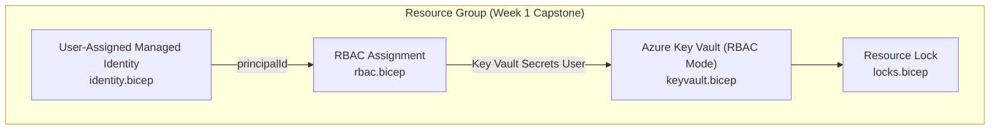

# Identity‑First Bicep Deployment Identity Stack (Week 1 Capstone)

> **Why this matters:** Deploying identity, Key Vault, RBAC, and locks as separate portal steps is error-prone and impossible to review or version — this lab assembles the same stack as modular Bicep so the entire foundation can be code-reviewed, diffed, and deployed in a single command.

Day 7 brings together the full **identity‑first architecture** for Week 1 using modular Bicep.
It forms the foundation of a secure, secretless, RBAC-driven Azure environment.

This page outlines the architecture, the module responsibilities, and the deployment flow.

All Bicep files referenced here are located in:

```plaintext
bicep/
```

---

## 🎯 Objective

Build a modular Bicep stack that deploys:

- A **User‑Assigned Managed Identity**
- A **Key Vault** configured for **RBAC**
- An **RBAC role assignment** granting the identity access to Key Vault
- A **resource lock** to protect the environment
- A clean **composition layer** (`main.bicep`)

This foundation carries forward into future capstones.

---

## 🧱 Final Folder Structure

```plaintext
bicep/
  main.bicep
  modules/
    identity.bicep
    keyvault.bicep
    rbac.bicep
    locks.bicep
```

Each module is small, focused, and reusable — following enterprise IaC patterns.

---

## 🗺️ Identity‑First Architecture Diagram



This diagram shows the identity-first flow:
**Identity → RBAC → Key Vault → Governance Lock**

---

## 🧩 Module Overview

### 1. identity.bicep  

Creates a **User‑Assigned Managed Identity** and outputs:

- `identityId` — full ARM resource ID  
- `identityPrincipalId` — AAD Object ID used for RBAC  

This identity becomes the root of the Week 1 architecture.

---

### 2. keyvault.bicep  

Deploys a **Key Vault in RBAC mode**, with:

- `enableRbacAuthorization: true`  
- `tenantId` binding  
- Standard SKU  

Outputs:

- `kvId` — used as RBAC scope and for diagnostics  

This ensures a modern, secretless, identity-first vault.

---

### 3. rbac.bicep  

Assigns the **Key Vault Secrets User** role to the Managed Identity.

Key behaviors:

- Uses a deterministic `guid()` for idempotency  
- Assigns at **resource group scope**  
- Uses `principalType: ServicePrincipal`  

This module enforces least privilege and repeatable deployments.

---

### 4. locks.bicep  

Applies a **CanNotDelete** lock to protect critical identity resources.

This enforces governance and prevents accidental deletion.

---

## 🧠 Composition Layer — main.bicep

The `main.bicep` file orchestrates the entire identity-first architecture:

- Deploys the Managed Identity  
- Deploys the Key Vault  
- Assigns RBAC permissions  
- Applies a governance lock  

The file references all modules inside the `modules/` folder, keeping the root clean and readable.

---

## 🧪 What Happens When You Deploy

The deployment creates:

1. **User‑Assigned Managed Identity**  
2. **Key Vault (RBAC mode)**  
3. **RBAC assignment** (Key Vault Secrets User → Managed Identity)  
4. **Resource lock** on the resource group  

This completes the identity-first foundation for Week 1.

---

## 🎉 Day 7 Complete

You now have:

- A fully modular identity-first Bicep stack  
- Clean, validated modules  
- A composition layer ready for deployment  
- Enterprise-grade RBAC and governance patterns  
- Documentation that is clean, readable, and recruiter-ready  

The separate capstone stack lives in `capstone/architecture/bicep/` to avoid duplication and keep the repo maintainable.

---

## 🔗 Related Labs

- **Day 1 — Identity Fundamentals + RBAC Basics**  
  [01-identity fundamentals.md](01-identity%20fundamentals.md)

- **Day 2 — Managed Identity + Azure Key Vault**  
  [02-managed Identity + Azure Key Vault (Secretless Authentication).md](02-managed%20Identity%20%2B%20Azure%20Key%20Vault%20%28Secretless%20Authentication%29.md)

- **Day 3 — Azure AD Roles + RBAC Scopes**  
  [03-azuread-roles-rbac-scopes.md](03-azuread-roles-rbac-scopes.md)

- **Day 4 — Azure Locks + Resource Policies**  
  [04-azurelocks-resource-policies.md](04-azurelocks-resource-policies.md)

- **Day 5 — Access Validation (Portal + CLI)**  
  [05-access-validation.md](05-access-validation.md)

- **Day 6 — Azure Monitor + Activity Logs**  
  [06-azuremonitor-activity-logs.md](06-azuremonitor-activity-logs.md)
