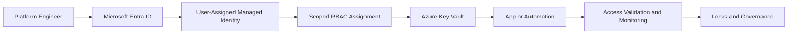

# Identity-First Architecture Track

This module demonstrates how to design and deploy an Azure foundation where identity is the first control plane decision, not a late-stage security add-on.

## Business Challenge

Platform teams often provision infrastructure first and bolt identity controls on later. This creates excess standing privilege, manual access workflows, and weak auditability.

## Architecture Logic

- Microsoft Entra ID anchors identity and role assignment strategy.
- Managed identities remove long-lived credentials from automation and workloads.
- Azure RBAC enforces scoped least-privilege access patterns.
- Key Vault centralizes secret governance where secrets are still required.
- Resource locks and policy controls reduce accidental or non-compliant drift.



## Prerequisites

- Azure subscription with permissions to create resource groups, role assignments, and key vault resources.
- Azure CLI installed and authenticated.
- VS Code with Bicep extension enabled.
- PowerShell available for validation steps where required.

## Deployment (Capstone)

From the repository root:

```bash
az deployment group create \
  --resource-group <resource-group> \
  --template-file Identity-First/capstone/architecture/bicep/main.bicep \
  --parameters location=eastus
```

## Validation Checklist

- Confirm managed identity exists and is bound to expected scope.
- Verify RBAC assignment is least privilege and not subscription-wide unless justified.
- Confirm Key Vault access model aligns to role design.
- Validate locks/policies are active on critical resources.
- Run access validation lab to prove expected allow/deny behavior.

## Lab Sequence

1. [Identity Fundamentals](01-identity%20fundamentals.md)
2. [Managed Identity + Key Vault](02-managed%20Identity%20%2B%20Azure%20Key%20Vault%20%28Secretless%20Authentication%29.md)
3. [Microsoft Entra Roles and RBAC Scopes](03-azuread-roles-rbac-scopes.md)
4. [Azure Locks and Resource Policies](04-azurelocks-resource-policies.md)
5. [Access Validation](05-access-validation.md)
6. [Azure Monitor and Activity Logs](06-azuremonitor-activity-logs.md)
7. [Identity-First Bicep Deployment Capstone](07-bicep-deployment-identity-stack.md)
8. [How to Run Bicep in VS Code](08-how-to-run-bicep-in-vscode.md)

## Folder Map

- [Bicep Root Template](bicep/main.bicep)
- [Bicep Modules](bicep/modules)
- [Capstone Architecture Templates](capstone/architecture/bicep)
- [Governance Flow Notes](governance-flow.md)
- [Identity Access Flow](identity-first-access-flow.md)
- [Lessons Learned](lessons-learned.md)
- [VS Code Deployment Workflow](vscode-deployment-workflow.md)

## Business Value Delivered

- Reduced secret and credential management overhead.
- Improved auditability of authorization decisions.
- Safer platform operations through lock and policy guardrails.
- Repeatable deployment path for onboarding new environments.
