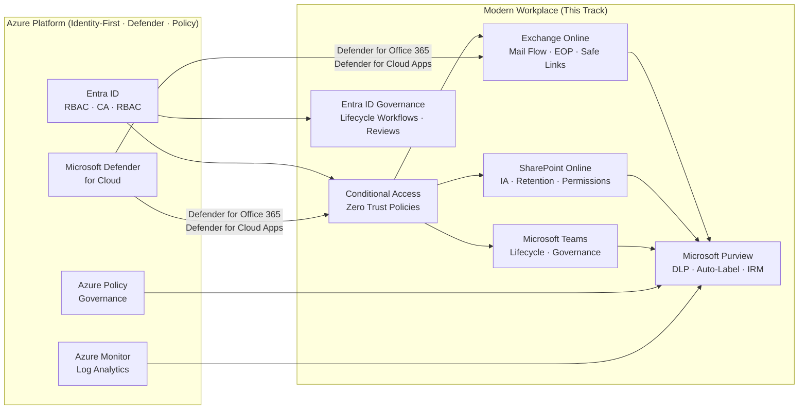

# Modern Workplace (Microsoft 365) Track

Last validated on: July 2026

## Identity-First Security · Zero Trust · Collaboration · Compliance · Governance

This repository contains a complete, enterprise-grade Modern Workplace engineering track for Microsoft 365, Entra ID, Exchange Online, SharePoint Online, Microsoft Teams, Microsoft Purview, and Entra ID Governance.

Each lab reflects real-world patterns used by Senior Cloud & Identity Engineers delivering secure, scalable, and governed Microsoft 365 environments in regulated enterprises. Labs are hands-on, production-aligned, and portfolio-ready.

---

## Track Overview

| # | Lab | Core Topics |
| --- | --- | --- |
| 1 | [Exchange Online Advanced](1-exchange-online-advanced.md) | Mail flow, transport rules, threat protection, journaling, governance |
| 2 | [SharePoint Information Architecture](2-sharepoint-information-architecture.md) | Metadata, content types, hub sites, permissions, retention |
| 3 | [Teams Lifecycle Governance](3-teams-lifecycle-governance.md) | Provisioning, naming policies, templates, channels, expiration |
| 4 | [Compliance Automation (Purview)](4-compliance-automation.md) | DLP, auto-labeling, insider risk, Compliance Manager |
| 5 | [Zero Trust Advanced](5-zero-trust-advanced.md) | Conditional Access, risk policies, session controls, passwordless |
| 6 | [Identity Governance](6-identity-governance-lifecycle-workflows.md) | Lifecycle workflows, access reviews, entitlement management, deprovisioning |

---

## Learning Outcomes

By completing this track, you will be able to:

- Architect and secure enterprise mail flow with multi-layer threat protection
- Design scalable SharePoint information architectures with metadata governance
- Implement Teams lifecycle governance to prevent sprawl and enforce compliance
- Automate compliance across Microsoft 365 using Microsoft Purview
- Deploy advanced Zero Trust Conditional Access policies with risk-based controls
- Automate identity lifecycle events using Entra ID Governance Lifecycle Workflows
- Integrate workloads across Purview, Entra ID, Intune, and Defender for a unified security posture
- Govern Copilot for Microsoft 365 access using Entra ID controls, sensitivity labels, and Purview data readiness policies

---

## Prerequisites

| Requirement | Notes |
| --- | --- |
| Microsoft 365 E3 or E5 tenant | E5 recommended for full Purview + Defender coverage |
| Entra ID P1 (minimum) | Required for Conditional Access |
| Entra ID P2 | Required for Identity Governance, PIM, and risk-based policies |
| Microsoft Intune | Required for device compliance policies (Lab 5) |
| Copilot for Microsoft 365 licence (optional) | Required only for Copilot-specific validation steps; labs function without it |
| Windows 10/11 test device | For device compliance and passwordless MFA validation |
| Global Administrator role | Initial setup only — transition to least-privilege roles after setup |
| Exchange Online PowerShell module | `Install-Module ExchangeOnlineManagement` |
| Microsoft Graph PowerShell SDK | `Install-Module Microsoft.Graph` |

---

## How This Track Connects to the Azure Architecture

This track does not stand alone — it extends the same identity plane, governance model, and Zero Trust framework established in the Azure tracks across this repo.

| Dependency | Connection |
| --- | --- |
| [Identity-First Track](../Identity-First/README.md) | Entra ID fundamentals, RBAC, and Conditional Access are the prerequisite foundation. Lab 5 (Zero Trust Advanced) builds directly on the identity patterns from Identity-First Labs 1–3. Complete those labs before this track if you haven't already. |
| [Secure Break-Glass Accounts](../Secure%20Break%E2%80%91Glass%20Accounts/README.md) | Lab 5 requires break-glass accounts excluded from Conditional Access policies. The dedicated Break-Glass track covers FIDO2 and Certificate-Based Authentication (CBA) emergency accounts in full — the patterns used for Azure admin accounts apply identically here. |
| [Microsoft Defender for Cloud](../Microsoft%20Defender%20for%20Cloud/README.md) | Defender for Office 365 threat protection (Lab 1) and Defender for Cloud Apps session controls (Lab 5) surface in the same Microsoft Defender portal used in the Defender for Servers track. Alerts from Azure VMs and M365 workloads are unified in Microsoft Defender XDR for end-to-end incident investigation. |
| [Azure Policy Auto-Remediation](../Azure%20Policy%20Auto%E2%80%91Remediation/README.md) | Compliance Manager (Lab 4) maps M365 controls to NIST, ISO, and GDPR. Azure Policy governs Azure resource compliance; Purview governs M365 data compliance. Together they provide a unified posture across the full estate. |
| [Naming Convention](../Naming-Convention.md) | Group, site, and Teams naming conventions in this track follow the same naming standard applied to Azure resources across the repo. |



---

## Architecture Philosophy

This track is built on an **Identity-First, Zero Trust, Governance-Driven** engineering model:

```text
Identity is the control plane
    └── Conditional Access enforces Zero Trust
    └── Least privilege is mandatory everywhere
    └── Compliance is automated via Purview
    └── Teams & SharePoint follow lifecycle governance
    └── Exchange Online follows secure mail flow patterns
    └── Copilot for M365 is governed by sensitivity labels + Entra ID access controls
    └── All workloads integrate with Purview & Entra Governance
```

### Design Principles

```text
Never trust, always verify.
    └── Every access request is authenticated, authorized, and continuously validated regardless of network location.

Assume breach.
    └── Segment access, minimize blast radius, and monitor everything through Purview audit logs and Defender telemetry.

Automate compliance.
    └── Manual compliance processes fail at scale. Sensitivity labels, DLP policies, retention, and lifecycle workflows are all policy-driven and automated.

Governance by design.
    └── Teams, SharePoint sites, shared mailboxes, and user accounts follow defined lifecycle stages — creation, operation, archival, and deletion — with no orphaned resources.
```

---

## Recommended Learning Path

Complete the labs in sequence. Each lab builds on the configuration established in prior labs.

```text
1. Exchange Online Advanced
        ↓
2. SharePoint Information Architecture
        ↓
3. Teams Lifecycle Governance
        ↓
4. Compliance Automation (Purview)
        ↓
5. Zero Trust Advanced (Conditional Access)
        ↓
6. Identity Governance (Lifecycle Workflows)
```

This sequence mirrors a real enterprise Microsoft 365 rollout: establish messaging and collaboration infrastructure first, layer compliance on top, then secure with Zero Trust, and finally automate identity governance.

## How to Use This Track

**Individual learners:** Work through each lab sequentially. Complete all validation steps before moving to the next lab. Screenshot your configuration for your portfolio.

**Engineering teams:** Use this as a baseline for Modern Workplace modernization projects. Adapt naming conventions, group structures, and policy parameters to your organizational standards.

**Review preparation:** Each lab covers objectives aligned with MS-102 (Microsoft 365 Administrator), SC-300 (Identity and Access Administrator), and SC-400 (Information Protection Administrator).

---

[← Back to Azure Hands-On Engineering](../README.md)
