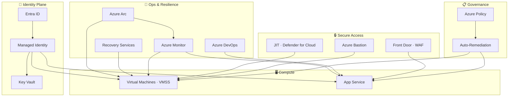

# Kia ora, I'm Nadeem Kadwaikar👋

Identity and Access Administrator focused on Azure security engineering. I remove credentials from application stacks using Managed Identity and Key Vault, enforce compliance through Policy with auto-remediation, and design emergency access that holds under Zero Trust constraints.

Every lab here is built end-to-end — deployed, tested, and documented from a real environment.

## Stack

---

## Platform Architecture

---

## Labs

| Lab | What it covers |
| --- | --- |
| [Azure Bastion](./Azure%20Bastion/README.md) | Browser-based RDP/SSH — no public IP, hub-spoke VNet Peering, secretless Key Vault auth |
| [Microsoft Defender for Cloud](./Microsoft%20Defender%20for%20Cloud/Readme.md) | Just-In-Time VM access — time-bounded NSG rules, zero standing inbound access |
| [Identity-First Stack](./Identity-First/README.md) | Managed Identity, Key Vault, RBAC, Locks, and Policy deployed end-to-end with Bicep |
| [App Service + Managed Identity + Deployment Slots + Azure DevOps](./App%20Service%20%2B%20Managed%20Identity%20%2B%20Deployment%20Slots%20%2B%20Azure%20DevOps/ReadME.md) | Secretless app config via Key Vault references, per-slot Managed Identity, multi-stage pipeline with manual approval gates |
| [Azure Policy Auto-Remediation](./Azure%20Policy%20Auto%E2%80%91Remediation/README.md) | Custom policy definitions, assignments, and automated remediation tasks |
| [VMSS & Golden Images](./VMSS/README.md) | Sysprep, generalized image capture, and scale set deployment from a golden image |
| [Azure Front Door](./Azure%20Front%20Door-Static%20Website%20Hosting/README.md) | WAF at the edge, custom domain with TLS, static website origin |
| [Backup & Site Recovery](./Recovery%20Services%20vaults/README.md) | VM backup and restore, ASR replication, storage redundancy options |
| [Break-Glass Accounts – FIDO2](./Secure%20Break%E2%80%91Glass%20Accounts/1-Secure%20Break%E2%80%91Glass%20Accounts.md) | Emergency access with FIDO2 hardware keys, Authentication Strength policy, Conditional Access enforcement |
| [Break-Glass Accounts – CBA](./Secure%20Break%E2%80%91Glass%20Accounts/2-Certificate-Based%20Authentication%28CBA%29for%20Emergency%20Access%20Accounts.md) | Certificate-based auth as phishing-resistant MFA for emergency accounts |
| [Entra Backup & Recovery](./Microsoft%20Entra%20Backup%20%26%20Recovery/README.md) | Entra ID configuration export, versioning, and restore procedures |
| [Compute & IIS](./Compute/README.md) | Base VM build, Sysprep, IIS installation |
| [Azure Arc Hybrid Server Architecture](./Azure%20Arc%20Hybrid%20Server%20Architecture/Readme.md) | Arc-enabled servers, Defender for Servers, Azure Monitor Agent, Update Manager, Guest Configuration |

---

## Reference

- [Naming Convention](./Naming-Convention.md) — resource abbreviations, segment pattern, and per-type naming rules used across all labs
- [Architecture Overview](./Architecture%20Overview.md) — system diagrams for every track

---

## In progress

- Defender for Cloud CSPM — security posture management across a hub-and-spoke architecture

---

## Get in touch

Open to conversations about platform engineering, identity architecture, and Zero Trust.

