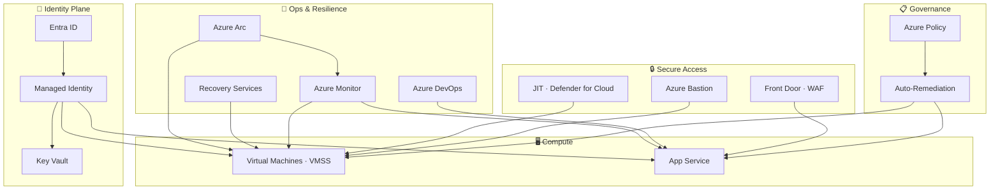

# 👋 Hi, I'm Nadeem Kadwaikar

Cloud & Identity Engineer — Azure · Microsoft 365 · Zero Trust

I design and build Azure environments that are secure by default, repeatable by design, and maintainable by the next engineer. My focus is identity-first architecture, infrastructure as code, and production-aligned governance — the kind of work that keeps regulated environments compliant and teams unblocked.

---

## 🎯 What I Bring to Teams

| Area | What I Do |
|---|---|
| **Azure Infrastructure** | VMs, VMSS, VNets, NSGs, Load Balancers, Front Door, Storage — built for resilience |
| **Identity & Zero Trust** | Microsoft Entra ID, RBAC, Conditional Access, Managed Identities, Key Vault |
| **IaC & Automation** | Modular Bicep deployments, GitHub Actions, PowerShell, Azure CLI |
| **Governance & Compliance** | Azure Policy, Resource Locks, Activity Logs, Monitor — aligned to regulated environments |
| **Microsoft 365** | Tenant admin, users & groups, security & compliance, endpoint basics |
| **Business Continuity** | Azure Backup, Site Recovery, VMSS failover patterns |

---

## 🗺️ Platform Architecture

---

## 📌 Labs & Guides

Each lab reflects a real Azure engineering pattern — not a tutorial walkthrough, but a production-aligned implementation with documented reasoning.

### 1. Identity-First Security & Zero Trust

- [Identity-First Bicep Capstone](Identity-First/07-bicep-deployment-identity-stack.md) — Modular Bicep stack: Managed Identity + Key Vault + RBAC + Governance Lock
- [Managed Identity + Key Vault](Identity-First/02-managed%20Identity%20%2B%20Azure%20Key%20Vault%20%28Secretless%20Authentication%29.md) — Secretless authentication; eliminates credential sprawl
- [Azure AD Roles & RBAC](Identity-First/03-azuread-roles-rbac-scopes.md) — Least-privilege role assignments across scopes
- [Break-Glass Accounts – FIDO2](Secure%20Break%E2%80%91Glass%20Accounts/1-Secure%20Break%E2%80%91Glass%20Accounts.md) — Emergency access with FIDO2 hardware keys and Conditional Access enforcement
- [Break-Glass Accounts – CBA](Secure%20Break%E2%80%91Glass%20Accounts/2-Certificate-Based%20Authentication%28CBA%29for%20Emergency%20Access%20Accounts.md) — Certificate-based auth as phishing-resistant MFA for emergency accounts
- [Entra Backup & Recovery](Microsoft%20Entra%20Backup%20%26%20Recovery/1-Microsoft%20Entra%20Backup%20%26%20Recovery.md) — Entra ID configuration export, versioning, and restore procedures

### 2. Azure Infrastructure as Code (IaC)

- [VS Code Bicep Deployment Workflow](Identity-First/11-vscode-deployment-workflow.md)
- [Naming Convention](Naming-Convention.md) — Resource abbreviations, segment pattern, and per-type naming rules used across all labs

### 3. Secure Access & Networking

- [Azure Bastion](Azure%20Bastion/1-Azure%20Bastion.md) — Browser-based RDP/SSH, no public IP, hub-spoke VNet peering, secretless Key Vault auth
- [Microsoft Defender for Cloud – JIT](Microsoft%20Defender%20for%20Cloud/1-JIT.md) — Time-bounded NSG rules, zero standing inbound access
- [Azure Front Door](Azure%20Front%20Door-Static%20Website%20Hosting/Azure%20Front%20Door-Static%20Website%20Hosting%20Lab.md) — WAF at the edge, custom domain with TLS, static website origin

### 4. Governance & Compliance

- [Azure Policy Auto-Remediation](Azure%20Policy%20Auto%E2%80%91Remediation/1-Azure%20Policy%20Auto%E2%80%91Remediation.md) — Custom policy definitions, assignments, and automated remediation tasks
- [Azure Monitor & Activity Logs](Identity-First/06-azuremonitor-activity-logs.md) — Audit trail and alerting for security events
- [Governance Flow Diagram](Identity-First/09-governance-flow.md)

### 5. Compute & Image Lifecycle

- [Build Base VM](Compute/1-build-base-vm.md)
- [Sysprep Azure VM](Compute/2-sysprep-vm.md)
- [Capture & Test Image](VMSS/1-capture-and-test-image.md)
- [VMSS Deployment](VMSS/2-vmss-deployment.md) — Auto-scaling VM fleet from a golden image

### 6. App Service & DevOps

- [App Service + Managed Identity + Deployment Slots + Azure DevOps](App%20Service%20%2B%20Managed%20Identity%20%2B%20Deployment%20Slots%20%2B%20Azure%20DevOps/App%20Service%20%2B%20Managed%20Identity%20%2B%20Deployment%20Slots%20%2B%20Azure%20DevOps.md) — Secretless app config via Key Vault references, per-slot Managed Identity, multi-stage pipeline with manual approval gates

### 7. Business Continuity & Resilience

- [Azure VM Backup](Recovery%20Services%20vaults/1-VM%20Backup%20and%20Restore%20Procedure.md) — RPO/RTO-aware backup configuration
- [Azure Site Recovery](Recovery%20Services%20vaults/2-Azure%20Site%20Recovery.md) — Cross-region failover for business continuity
- [Storage Replication](Recovery%20Services%20vaults/3-Azure%20storage%20replication.md) — LRS, ZRS, GRS, RA-GZRS — redundancy options and geo-failover

### 8. Hybrid & Arc

- [Azure Arc Hybrid Server Architecture](Azure%20Arc%20Hybrid%20Server%20Architecture/Azure%20Arc%20Hybrid%20Server%20Architecture.md) — Arc-enabled servers, Defender for Servers, Azure Monitor Agent, Update Manager, Guest Configuration

---

## 🛠️ In Progress

- Defender for Cloud CSPM — security posture management across a hub-and-spoke architecture
- Copilot Studio — AI agent with SharePoint knowledge source, secured with Entra ID

---

## 💡 Engineering Philosophy

I build things that future-me — and future teams — can pick up without unpacking a mess. Every lab here is shaped by three principles: **clarity** (documented decisions, not just commands), **repeatability** (idempotent deployments, not one-time scripts), and **secure defaults** (identity-first, least privilege, no hardcoded credentials).

---

💼 [LinkedIn](https://linkedin.com/in/nadeemkadwaikar) · 📧 nadeemkadwaikar@outlookcom

---
Last updated: June 2026
