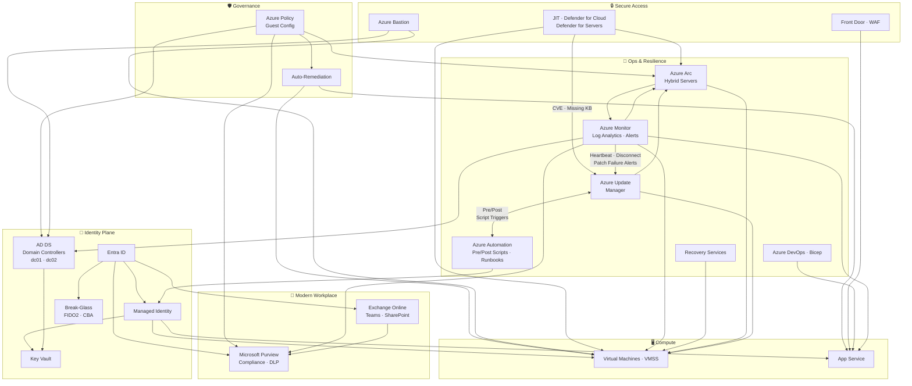

# 👋 Hi, I'm **Nadeem Kadwaikar**

Last validated on: 2026-07-12

I build identity‑first Azure platforms that remain secure, compliant, and maintainable long after deployment. My work centres on Zero Trust, Infrastructure as Code, and production-aligned governance — the engineering patterns that keep regulated environments safe and teams unblocked. Every solution is built with [cost and security governance](Cost%20and%20Security%20Governance.md) as a design constraint, not an afterthought.

> **New here?** Start with [Identity-First](Identity-First/README.md) — every other track builds on it.
> **Jumping in?** Use the [track navigator below](#%EF%B8%8F-how-to-follow-these-tracks), or go straight to the [Modern Workplace Track](Microsoft%20365/README.md) or [Architecture Overview](Architecture%20Overview.md).

---

## 👥 Who This Is Designed For

Built for cloud engineers and identity architects evaluating production-aligned Azure engineering — specifically Zero Trust design, IaC with Bicep, and governance in regulated or enterprise environments.

| Role | What you'll find here |
| --- | --- |
| **Cloud / Platform Engineer** | End-to-end IaC (Bicep), VM lifecycle, VMSS, App Service pipelines, Arc hybrid management |
| **Identity & Security Engineer** | Zero Trust, Managed Identity, Key Vault, RBAC, Conditional Access, Break-Glass accounts, JIT |
| **Governance / Compliance Engineer** | Azure Policy + auto-remediation, Resource Locks, Purview DLP, Compliance Manager, Activity Logs |
| **Modern Workplace Engineer** | Exchange Online, Teams lifecycle, SharePoint IA, Purview, Entra ID Governance lifecycle workflows |

---

## 🏗️ Featured Architecture

---

## 🧠 Why This Architecture Matters

- 🔐 **Identity-first access** eliminates credential sprawl — Managed Identity + Key Vault enforces secretless authentication at every layer
- 🚫 **Zero standing access** (Bastion + JIT) removes all inbound exposure and eliminates persistent privileged sessions
- 🔑 **Break-Glass accounts** (FIDO2 + Certificate-Based Auth) guarantee emergency access without bypassing Zero Trust controls
- 🛡️ **Governance-as-code** (Azure Policy + Auto-Remediation) enforces compliance continuously across cloud and hybrid resources — no manual audits
- 🌍 **Secure public ingress** (Front Door + WAF) protects internet-facing workloads at the edge before traffic reaches the application layer
- 🏢 **AD DS in Azure** provides a production-grade domain fabric, built on Availability Sets with no public IPs and DSRM secrets sealed in Key Vault
- 🌐 **Hybrid reach via Azure Arc** extends unified policy, monitoring, and Defender for Servers to on-premises and multi-cloud workloads
- ⚙️ **VMSS + Azure DevOps + Bicep** delivers repeatable, scalable deployments with multi-stage pipelines and deployment slot promotion
- 💼 **Modern Workplace governance** (Exchange Online, Teams, SharePoint, Purview) extends Zero Trust and compliance into M365 workloads
- ♻️ **Built-in resilience** (Azure Backup, Site Recovery, VMSS failover) ensures business continuity without sacrificing security posture

---

## 🗺️ How to Follow These Tracks

| If you're… | Start here | What's covered |
| --- | --- | --- |
| Evaluating my architecture approach | [Architecture Overview](Architecture%20Overview.md) | High-level visual of how every component connects |
| Reviewing identity & Zero Trust | [Identity-First Track](Identity-First/README.md) | Entra ID, RBAC, Conditional Access, Managed Identities, Key Vault |
| Reviewing break-glass & emergency access | [Break-Glass Accounts](Secure%20Break-Glass%20Accounts/README.md) | FIDO2 emergency accounts, Certificate-Based Authentication (CBA) |
| Reviewing Entra backup & recovery | [Entra Backup & Recovery](Microsoft%20Entra%20Backup%20%26%20Recovery/README.md) | Entra ID backup strategies and recovery procedures |
| Assessing IaC & automation | [Bicep Track](Bicep/README.md) | Modular Bicep deployments, GitHub Actions, PowerShell, Azure CLI |
| Checking governance & compliance | [Azure Policy Auto-Remediation](Azure%20Policy%20Auto%E2%80%91Remediation/README.md) | Azure Policy, Resource Locks, Activity Logs, Monitor |
| Reviewing secure access & networking | [Azure Bastion](Azure%20Bastion/README.md) · [Defender for Cloud](Microsoft%20Defender%20for%20Cloud/README.md) · [Front Door](Azure%20Front%20Door-Static%20Website%20Hosting/README.md) | Zero standing access, JIT + Defender for Servers workload protection, WAF, inbound exposure removal |
| Following compute & image lifecycle | [Compute Track](Compute/README.md) · [VMSS](VMSS/README.md) | VMs, VMSS, VNets, NSGs, Load Balancers — built for resilience |
| Assessing App Service & DevOps pipelines | [App Service + Managed Identity](App%20Service%20%2B%20Managed%20Identity%20%2B%20Deployment%20Slots%20%2B%20Azure%20DevOps/README.md) | Deployment slots, multi-stage pipelines, secretless auth |
| Reviewing business continuity & resilience | [Recovery Services Track](Recovery%20Services%20vaults/README.md) | Azure Backup, Site Recovery, VMSS failover patterns |
| Exploring hybrid & Arc-enabled servers | [Azure Arc Track](Azure%20Arc%20Hybrid%20Server%20Architecture/README.md) | Arc projection, CMA onboarding, AMA + DCR monitoring, hybrid governance, Hyper-V lab |
| Assessing patch compliance & update orchestration | [Azure Update Manager](Azure%20Update%20Manager/README.md) | Patch assessment, periodic (24-hour) assessment, maintenance windows, update deployments, compliance dashboard, Updates pane (CVE/KB-centric view), Quick Alerts (ARG-backed native alerting), cross-subscription patching, hotpatching, pricing and licensing, hybrid fleet pipeline (Arc → Defender for Servers → Update Manager), patch group tagging strategy, prod vs non-prod patching strategy, Arc agent disconnect alerting, pre/post scripts, rollback, CVE-to-KB mapping, zero-day response playbook, DC staggered reboot runbook, Bicep IaC, and [Arc Server Patch Verification Toolkit](Azure%20Update%20Manager/Arc%20Server%20Patch%20Verification%20Toolkit/README.md) (enforce and verify Azure-only patching mode before configuring Update Manager) — covers Azure VMs, Arc-enabled servers, VMware vSphere (Arc), SCVMM (Arc), and Azure Local |
| Standing up AD DS in Azure | [DC in Azure Track](Deploying%20a%20Domain%20Controller%20in%20Azure/README.md) | Azure-hosted AD DS: VNet + Bastion (no public IPs), NSG AD DS rules, Availability Set, forest creation, replication, FSMO roles, Key Vault for DSRM secrets |
| Reviewing Modern Workplace (M365) | [Modern Workplace Track](Microsoft%20365/README.md) | Exchange Online, SharePoint, Teams, Purview, Identity Lifecycle |
| Understanding the naming standard | [Naming Convention](Naming-Convention.md) | One consistent naming scheme across the entire portfolio |

---

## 🛠️ Skills & Technology Coverage

| Domain | Technologies Demonstrated |
| --- | --- |
| **Identity & Access** | Microsoft Entra ID, Managed Identity (UAMI + SAMI), RBAC, Conditional Access, Authentication Strength, FIDO2, CBA, Privileged Identity Management |
| **Secrets & Key Management** | Azure Key Vault (RBAC mode), secretless app authentication, Key Vault references in App Service |
| **Infrastructure as Code** | Bicep (modular, parameterised), Azure CLI, PowerShell, ARM deployment scopes |
| **Compute** | Azure Virtual Machines, VM Scale Sets, Compute Gallery, golden image pipeline (Sysprep → capture → VMSS) |
| **Networking & Secure Access** | Azure Bastion, JIT VM access, NSG design, VNet Peering, Azure Front Door, WAF |
| **App Delivery & DevOps** | Azure App Service, deployment slots, system-assigned Managed Identity per slot, Azure DevOps YAML pipelines, multi-stage approvals |
| **Governance & Policy** | Azure Policy (Audit, Deny, DeployIfNotExists), auto-remediation, Resource Locks, Activity Logs, KQL queries |
| **Resilience & DR** | Azure Backup, Azure Site Recovery (failover/failback), storage replication tiers (LRS → GZRS) |
| **Hybrid & Arc** | Azure Arc Connected Machine Agent, AMA + DCR, Defender for Servers, Guest Configuration, Update Manager |
| **Patch Management** | Azure Update Manager, periodic assessment, hotpatching, Updates pane (CVE/KB-centric view), Quick Alerts (ARG-backed), cross-subscription patching, hybrid fleet pipeline (Arc → Defender for Servers → Update Manager), maintenance configurations (staged: dev → uat → prod → dc), Arc agent disconnect alerting, pre/post Automation runbooks, CVE-to-KB mapping, zero-day response, compliance reporting, Arc Server Patch Verification Toolkit (Azure-only patching mode enforcement + verification), Azure Resource Graph KQL — Azure VMs, Arc servers, VMware vSphere (Arc), SCVMM (Arc), Azure Local |
| **Active Directory** | AD DS forest in Azure (two DCs, Availability Set, static IPs, DSRM in Key Vault, FSMO distribution) |
| **Microsoft 365** | Exchange Online, SharePoint Online, Teams lifecycle governance, Microsoft Purview (DLP, auto-labeling, Insider Risk), Zero Trust CA, Entra ID Governance lifecycle workflows |
| **Monitoring & Alerting** | Azure Monitor, Log Analytics Workspaces, KQL, Diagnostic Settings, Alert Rules, Action Groups, Azure Resource Graph |

---

## 💰 Cost Governance

All labs are designed to minimise Azure spend using right-sizing, auto-shutdown, scoped logging, and consumption-based services. Costs are kept predictable and low for learning environments. See the full [Cost and Security Governance](Cost%20and%20Security%20Governance.md) reference for cost optimisation practices and security non-negotiables applied across every track.

---

## 🚀 Next

What I'm building next reflects where enterprise Azure is heading AI augmented operations, deeper security posture management, and Copilot-native engineering all on a Zero Trust foundation.

| Planned | Why |
| --- | --- |
| Defender for Cloud CSPM | Extend cloud security posture management at scale across a hub-and-spoke topology — building on the Defender for Servers foundation already covered in the [Defender for Cloud track](Microsoft%20Defender%20for%20Cloud/README.md) |
| Copilot for Security | Integrate Microsoft Security Copilot into the incident response and identity investigation workflow |
| Copilot Studio | AI agent backed by a SharePoint knowledge source, secured with Entra ID applied AI on a Zero Trust foundation |

---

## 💡 Engineering Philosophy

I build systems that future‑me — and future teams — can pick up without sorting through a mess.

My work is shaped by three principles:

- **Clarity** — document decisions, not just commands
- **Repeatability** — deployments that run cleanly every time
- **Secure Defaults** — identity-first, least privilege, no hardcoded credentials

---

## 🤝 Connect

- 💼 [LinkedIn](https://linkedin.com/in/nadeemkadwaikar)
- 📧 [nadeemkadwaikar@outlook.com](mailto:nadeemkadwaikar@outlook.com)

