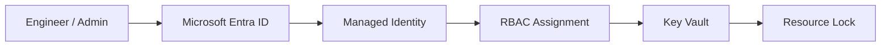
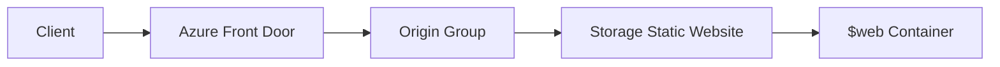
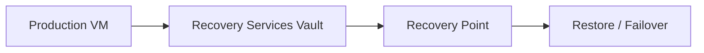

# Azure Hands-On Engineering Labs

Simple, practical Azure labs focused on Infrastructure as Code, identity-first security, governance, and recovery.


## What This Repo Covers

- Identity and access governance
- Compute image lifecycle and scale sets
- Global content delivery with Front Door
- Policy-based governance auto-remediation
- Backup, restore, and disaster recovery

## Outcomes

After completing these labs, you will be able to:

- Design identity-first Azure architectures with least-privilege access.
- Deploy repeatable infrastructure using Bicep and Azure CLI.
- Build and scale standardized compute images with VMSS.
- Implement governance controls with policy evaluation and remediation.
- Validate backup and recovery workflows against RPO and RTO goals.

## Quick Start

### Prerequisites

- Azure subscription
- Azure CLI
- VS Code + Bicep extension
- PowerShell and curl (for validation steps)

### Deploy Example (Identity Bicep Capstone)

```bash
az deployment group create \
	--resource-group <resource-group> \
	--template-file Identity-First/bicep/main.bicep \
	--parameters location=eastus
```

## Suggested Learning Path

1. [Identity Fundamentals](<Identity-First/01-identity fundamentals.md>)
2. [Managed Identity + Key Vault](<Identity-First/02-managed Identity + Azure Key Vault (Secretless Authentication).md>)
3. [Identity-First Bicep Capstone](<Identity-First/07-bicep-deployment-identity-stack.md>)
4. [Azure Front Door + Static Website](<Azure Front Door-Static Website Hosting/Azure Front Door-Static Website Hosting Lab.md>)
5. [Azure Policy Auto-Remediation](<Azure Policy Auto‑Remediation/1-Azure Policy Auto‑Remediation.md>)

## Module Index

### 01 Identity Governance

- Track overview: [Identity-First README](<Identity-First/README.md>)
- Labs: [Identity Fundamentals](<Identity-First/01-identity fundamentals.md>), [Managed Identity + Key Vault](<Identity-First/02-managed Identity + Azure Key Vault (Secretless Authentication).md>), [RBAC Scopes](<Identity-First/03-azuread-roles-rbac-scopes.md>)

### 02 Compute Lifecycle

- Labs: [Build Base VM](<Compute/1-build-base-vm.md>), [Sysprep VM](<Compute/2-sysprep-vm.md>), [Install IIS](<Compute/3-Install IIS.md>), [Capture and Test Image](<VMSS/1-capture-and-test-image.md>), [VMSS Deployment](<VMSS/2-vmss-deployment.md>)

### 03 Global Delivery

- Lab: [Azure Front Door + Static Website Hosting](<Azure Front Door-Static Website Hosting/Azure Front Door-Static Website Hosting Lab.md>)

### 04 Governance Automation

- Lab: [Azure Policy Auto-Remediation](<Azure Policy Auto‑Remediation/1-Azure Policy Auto‑Remediation.md>)

### 05 Business Continuity

- Labs: [Microsoft Entra Backup and Recovery](<%20Microsoft Entra Backup & Recovery/1-Microsoft Entra Backup & Recovery.md>), [Azure VM Backup](<Recovery Services vaults/1-VM Backup and Restore Procedure.md>), [Azure Site Recovery](<Recovery Services vaults/2-Azure Site Recovery.md>), [Azure Storage Replication](<Recovery Services vaults/3-Azure storage replication.md>)

### 06 Emergency Access

- Lab: [Secure Break-Glass Accounts](<Secure Break‑Glass Accounts/1-Secure Break‑Glass Accounts.md>)

## Architecture at a Glance

### Identity Governance



### Global Delivery



### Business Continuity



## In Development

- Azure App Services with managed identity and deployment slots.
- Defender for Cloud CSPM in hub-and-spoke architectures.
- Azure Arc hybrid server management patterns.

---

Last updated: June 2026. Built for maintainable engineering and enterprise-ready Azure patterns.

[LinkedIn](https://linkedin.com/in/nadeemkadwaikar) | nadeemkadwaikar@outlook.com | [License](<LICENSE>)