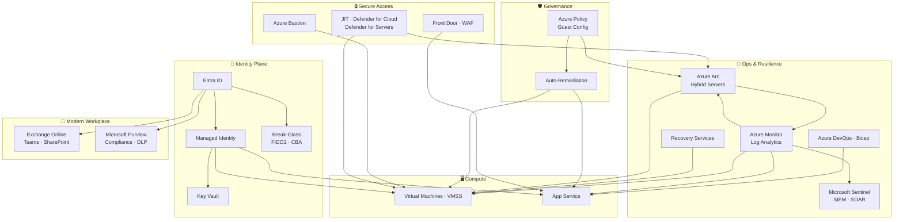

# 👋 Hi, I'm **Nadeem Kadwaikar**

I build identity‑first Azure platforms that remain secure, compliant, and maintainable long after deployment. My work centres on Zero Trust, Infrastructure as Code, and production aligned governance the engineering patterns that keep regulated environments safe and teams unblocked. Every solution is built with [cost and security governance](Cost%20and%20Security%20Governance.md) as a design constraint, not an afterthought.

> **New here?** Start with [Identity-First](Identity-First/README.md) — every other track builds on it.
> **Jumping in?** Use the [track navigator below](#%EF%B8%8F-how-to-follow-these-tracks), or go straight to the [Modern Workplace Track](Microsoft%20365/README.md) or [Architecture Overview](Architecture%20Overview.md).

---

## 👥 Who This Is Designed For

Built for cloud engineers and identity architects who are evaluating production aligned Azure engineering specifically Zero Trust design, IaC with Bicep, and governance in regulated or enterprise environments.

---

## 💰 Cost Governance

All labs are designed to minimise Azure spend using right‑sizing, auto‑shutdown, scoped logging, and consumption‑based services. Costs are kept predictable and low for learning environments.

---

## 🏗️ Featured Architecture

---

## 🧠 Why This Architecture Matters

- 🔐 Identity-first access eliminates credential sprawl
- 🚫 Zero standing access (Bastion + JIT) removes inbound exposure
- 🛡️ Governance-as-code enforces compliance automatically
- 🔑 Managed Identity + Key Vault ensures secretless authentication
- 📈 VMSS + Azure DevOps enables repeatable, scalable deployments

---

## 🗺️ How to Follow These Tracks

| If you're… | Start here | What's covered |
| --- | --- | --- |
| Evaluating my architecture approach | [Architecture Overview](Architecture%20Overview.md) | High-level visual of how every component connects |
| Reviewing identity & Zero Trust | [Identity-First Track](Identity-First/README.md) | Entra ID, RBAC, Conditional Access, Managed Identities, Key Vault |
| Reviewing break-glass & emergency access | [Break-Glass Accounts](Secure%20Break%E2%80%91Glass%20Accounts/README.md) | FIDO2 emergency accounts, Certificate-Based Authentication (CBA) |
| Reviewing Entra backup & recovery | [Entra Backup & Recovery](Microsoft%20Entra%20Backup%20%26%20Recovery/README.md) | Entra ID backup strategies and recovery procedures |
| Assessing IaC & automation | [Bicep Track](Bicep/README.md) | Modular Bicep deployments, GitHub Actions, PowerShell, Azure CLI |
| Checking governance & compliance | [Azure Policy Auto-Remediation](Azure%20Policy%20Auto%E2%80%91Remediation/README.md) | Azure Policy, Resource Locks, Activity Logs, Monitor |
| Reviewing secure access & networking | [Azure Bastion](Azure%20Bastion/README.md) · [JIT](Microsoft%20Defender%20for%20Cloud/README.md) · [Front Door](Azure%20Front%20Door-Static%20Website%20Hosting/README.md) | Zero standing access, WAF, inbound exposure removal |
| Following compute & image lifecycle | [Compute Track](Compute/README.md) · [VMSS](VMSS/README.md) | VMs, VMSS, VNets, NSGs, Load Balancers — built for resilience |
| Assessing App Service & DevOps pipelines | [App Service + Managed Identity](App%20Service%20%2B%20Managed%20Identity%20%2B%20Deployment%20Slots%20%2B%20Azure%20DevOps/README.md) | Deployment slots, multi-stage pipelines, secretless auth |
| Reviewing business continuity & resilience | [Recovery Services Track](Recovery%20Services%20vaults/README.md) | Azure Backup, Site Recovery, VMSS failover patterns |
| Exploring hybrid & Arc-enabled servers | [Azure Arc Track](Azure%20Arc%20Hybrid%20Server%20Architecture/README.md) | Arc-enabled servers, Defender for Servers, Hyper-V lab |
| Reviewing Modern Workplace (M365) | [Modern Workplace Track](Microsoft%20365/README.md) | Exchange Online, SharePoint, Teams, Purview, Identity Lifecycle |
| Understanding the naming standard | [Naming Convention](Naming-Convention.md) | One consistent naming scheme across the entire portfolio |

---

## � Next

What I'm building next reflects where enterprise Azure is heading AI augmented operations, deeper security posture management, and Copilot-native engineering all on a Zero Trust foundation.

| Planned | Why |
| --- | --- |
| Defender for Cloud CSPM | Extend security posture management and recommendations across a hub-and-spoke topology |
| Copilot for Security | Integrate Microsoft Security Copilot into the incident response and identity investigation workflow |
| Copilot Studio | AI agent backed by a SharePoint knowledge source, secured with Entra ID — applied AI on a Zero Trust foundation |

---

## 💡 Engineering Philosophy

I build systems that future‑me — and future teams — can pick up without sorting through a mess.

My work is shaped by three principles:

- **Clarity** — document decisions, not just commands
- **Repeatability** — deployments that run cleanly every time
- **Secure Defaults** — identity-first, least privilege, no hardcoded credentials

---

## 🤝 Connect

- 💼 [LinkedIn](https://linkedin.com/in/nadeemkadwaikar)
- 📧 [nadeemkadwaikar@outlook.com](mailto:nadeemkadwaikar@outlook.com)

