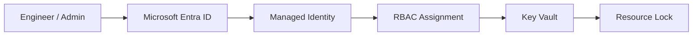
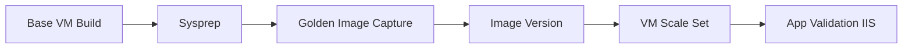
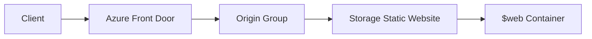
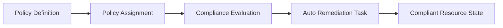
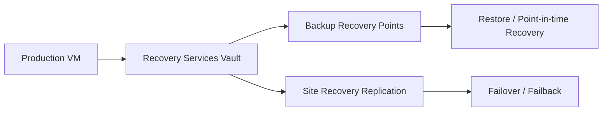
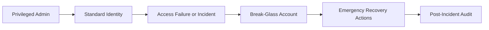

# Azure Hands-On Engineering

## Identity‑First Architecture • Governance • Automation • Resilience

I’m Nadeem Kadwaikar, and I design and document Azure solutions with an engineering‑first mindset — identity, governance, automation, and resilient cloud architectures.

A comprehensive set of Azure engineering labs, architecture notes, and implementation walkthroughs showcasing identity‑centric design, governance controls, and recovery‑ready cloud engineering.

Built for Azure cloud engineers.

[](https://azure.microsoft.com)
[](https://learn.microsoft.com/azure/azure-resource-manager/bicep/)
[](https://learn.microsoft.com/security/zero-trust/)
[](https://learn.microsoft.com/powershell/)
[](LICENSE)

If badges do not render in your viewer: Azure | Bicep | Zero Trust | PowerShell | MIT License.

## Table of Contents

- [What I Explore](#what-i-explore)
- [Why It Matters](#why-it-matters)
- [Get Started](#get-started)
- [Naming Convention](#naming-convention)
- [A 30-Minute Starting Path](#a-30-minute-starting-path)
- [Recommended Reading Path](#recommended-reading-path)
- [Full Topic Index](#full-topic-index)
- [Architecture Overview](#architecture-overview)
- [What I'm Working On](#what-im-working-on)

## What I Explore

- Identity and access governance
- Compute image lifecycle and scale sets
- Global content delivery with Front Door and static hosting
- Policy-based governance and auto-remediation
- Backup, restore, and disaster recovery

## Why It Matters

After working through these labs, you will be able to:

- Design identity-first Azure architectures with least-privilege access.
- Deploy repeatable infrastructure using Bicep and Azure CLI.
- Build and scale standardized compute images with VMSS.
- Implement governance controls with policy evaluation and remediation.
- Validate backup and recovery workflows against RPO and RTO goals.

## Get Started

### Prerequisites

- Azure subscription
- Azure CLI
- VS Code with the Bicep extension
- PowerShell and curl for validation steps

### Deploy Example (Identity Bicep Capstone)

```bash
az deployment group create \
	--resource-group <resource-group> \
	--template-file Identity-First/capstone/architecture/bicep/main.bicep \
	--parameters location=eastus
```

The standalone module examples are in `Identity-First/bicep/`, and the deployable Week 1 capstone stack is in `Identity-First/capstone/architecture/bicep/`.

### Path Name Note

Some folders intentionally use a non-breaking hyphen (`‑`, U+2011), such as `Azure Policy Auto‑Remediation` and `Secure Break‑Glass Accounts`.
For terminal commands, prefer tab completion or copy/paste paths directly from this repo to avoid subtle path mismatches.
If typing manually, use wildcard navigation to avoid Unicode mismatch issues:

```bash
cd Azure\ Policy\ Auto*Remediation
cd Secure\ Break*Accounts
```

If this causes repeated team friction, renaming folders to plain ASCII hyphen (`-`) is a reasonable trade-off.

## Naming Convention

Use these naming patterns across labs to keep resources discoverable, sortable, and policy-friendly.

- Pattern: `<org>-<workload>-<env>-<region>-<type>-<instance>`
- Keep names lowercase where the Azure resource allows it
- Use short, stable workload and environment tokens (for example: `id`, `gov`, `prod`, `dev`)
- Use Azure region short codes consistently (for example: `eus`, `wus2`, `weu`)
- Reserve numeric suffixes for scale/replicas (for example: `01`, `02`)

Examples:

- Resource group: `rg-id-prod-eus-01`
- User-assigned managed identity: `uami-id-prod-eus-01`
- Key Vault: `kv-id-prod-eus-01`
- Storage account: `stidprodeus01` (no hyphens for storage account naming rules)
- Virtual machine: `vm-id-prod-eus-01`

## A 30-Minute Starting Path

Short on time? Start here:

1. Spend 5 minutes on [Identity Fundamentals](<Identity-First/01-identity fundamentals.md>) to align on core concepts.
2. Spend 10 minutes on [Managed Identity + Key Vault](<Identity-First/02-managed Identity + Azure Key Vault (Secretless Authentication).md>) to learn secretless access.
3. Spend 10 minutes on [Azure Front Door + Static Website Hosting](<Azure Front Door-Static Website Hosting/Azure Front Door-Static Website Hosting Lab.md>) to see global delivery in practice.
4. Spend 5 minutes on [Azure Policy Auto-Remediation](<Azure Policy Auto‑Remediation/1-Azure Policy Auto‑Remediation.md>) to understand governance automation.

In 30 minutes, you will understand the identity-first model, secretless authentication, edge delivery basics, and policy-driven governance.

## Recommended Reading Path

This is the primary quick navigation path for first-time readers.

1. [Identity-First Track Overview](<Identity-First/README.md>)
2. [Identity Fundamentals](<Identity-First/01-identity fundamentals.md>)
3. [Managed Identity + Key Vault](<Identity-First/02-managed Identity + Azure Key Vault (Secretless Authentication).md>)
4. [Identity-First Access Flow](<Identity-First/identity-first-access-flow.md>)
5. [Identity-First Bicep Capstone](<Identity-First/07-bicep-deployment-identity-stack.md>)
6. [Run Bicep in VS Code](<Identity-First/08-how-to-run-bicep-in-vscode.md>)

## Full Topic Index

Use this as the complete domain-by-domain reference.

### 01 Identity Governance

- [Identity-First README](<Identity-First/README.md>)
- [Identity Fundamentals](<Identity-First/01-identity fundamentals.md>), [Managed Identity + Key Vault](<Identity-First/02-managed Identity + Azure Key Vault (Secretless Authentication).md>), [RBAC Scopes](<Identity-First/03-azuread-roles-rbac-scopes.md>)
- [Identity Access Flow](<Identity-First/identity-first-access-flow.md>), [How to Run Bicep in VS Code](<Identity-First/08-how-to-run-bicep-in-vscode.md>), [Lessons Learned](<Identity-First/lessons-learned.md>)

### 02 Compute Lifecycle

- [Build Base VM](<Compute/1-build-base-vm.md>), [Sysprep VM](<Compute/2-sysprep-vm.md>), [Install IIS](<Compute/3-Install IIS.md>), [Capture and Test Image](<VMSS/1-capture-and-test-image.md>), [VMSS Deployment](<VMSS/2-vmss-deployment.md>)

### 03 Global Delivery

- [Azure Front Door + Static Website Hosting](<Azure Front Door-Static Website Hosting/Azure Front Door-Static Website Hosting Lab.md>)

### 04 Governance Automation

- [Azure Policy Auto-Remediation](<Azure Policy Auto‑Remediation/1-Azure Policy Auto‑Remediation.md>)

### 05 Business Continuity

- [Microsoft Entra Backup and Recovery](<Microsoft Entra Backup & Recovery/1-Microsoft Entra Backup & Recovery.md>), [Azure VM Backup](<Recovery Services vaults/1-VM Backup and Restore Procedure.md>), [Azure Site Recovery](<Recovery Services vaults/2-Azure Site Recovery.md>), [Azure Storage Replication](<Recovery Services vaults/3-Azure storage replication.md>)

### 06 Emergency Access

- [Secure Break-Glass Accounts](<Secure Break‑Glass Accounts/1-Secure Break‑Glass Accounts.md>)

## Architecture Overview

### Identity Governance

Text flow: Engineer/Admin -> Microsoft Entra ID -> Managed Identity -> RBAC -> Key Vault -> Resource Lock.



### Compute Lifecycle

Text flow: Base VM Build -> Sysprep -> Golden Image -> Gallery Version -> VMSS -> Validation.



### Global Delivery

Text flow: Client -> Front Door -> Origin Group -> Storage Static Website -> $web content.



### Governance Automation

Text flow: Policy Definition -> Assignment -> Compliance Evaluation -> Auto-remediation -> Compliant state.



### Business Continuity

Text flow: Production VM -> Recovery Services Vault -> Backup/ASR -> Restore or Failover.



### Emergency Access

Text flow: Standard identity fails during incident -> Break-glass account -> Recovery actions -> Audit.



## What I'm Working On

- Azure App Services with managed identity and deployment slots
- Defender for Cloud CSPM in hub-and-spoke architectures
- Azure Arc hybrid server management patterns


---

Last updated: June 2026. I update this monthly to keep the guidance practical and enterprise-ready.

[LinkedIn](https://linkedin.com/in/nadeemkadwaikar) | nadeemkadwaikar@outlook.com | [License](<LICENSE>)