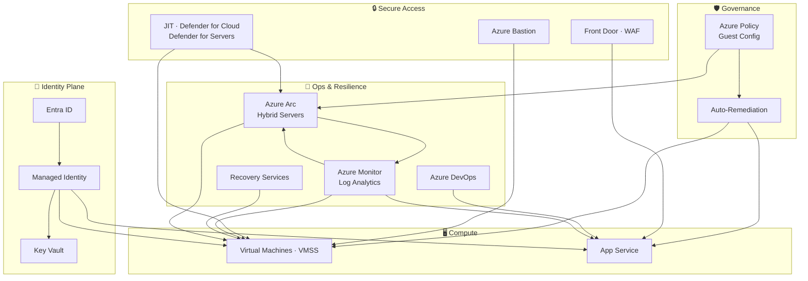

# 👋 Hi, I'm Nadeem Kadwaikar

I build identity‑first Azure platforms that remain secure, compliant, and maintainable long after deployment. My work centres on Zero Trust, Infrastructure as Code, and production‑aligned governance — the engineering patterns that keep regulated environments safe and teams unblocked. Every solution is built with [cost and security governance](Cost%20Governance.md) as a design constraint, not an afterthought.

> **New here?** Start with [Identity-First](Identity-First/README.md) — every other track builds on it.  
> **Jumping in?** Go straight to [Labs & Engineering Tracks](#-labs--engineering-tracks) or the [Architecture Overview](Architecture%20Overview.md).

---

## 🧭 Navigation

- [Skills](#-skills)
- [Featured Architecture](#️-featured-architecture)
- [Why This Architecture Matters](#-why-this-architecture-matters)
- [Recommended Lab Path](#-recommended-lab-path)
- [Labs & Engineering Tracks](#-labs--engineering-tracks)
- [Next](#️-next)
- [Engineering Philosophy](#-engineering-philosophy)
- [Connect](#-connect)

---

## 🎯 Skills

| Area | What I Do |
| --- | --- |
| Azure Infrastructure | VMs, VMSS, VNets, NSGs, Load Balancers, Front Door, Storage — built for resilience |
| Identity & Zero Trust | Microsoft Entra ID, RBAC, Conditional Access, Managed Identities, Key Vault |
| IaC & Automation | Modular Bicep deployments, GitHub Actions, PowerShell, Azure CLI |
| Governance & Compliance | Azure Policy, Resource Locks, Activity Logs, Monitor — aligned to regulated environments |
| Microsoft 365 | Tenant admin, users & groups, security & compliance, endpoint basics |
| Business Continuity | Azure Backup, Site Recovery, VMSS failover patterns |

---

## 🏗️ Featured Architecture

---

## 🧠 Why This Architecture Matters

- 🔐 Identity-first access eliminates credential sprawl
- 🚫 Zero standing access (Bastion + JIT) removes inbound exposure
- 🛡️ Governance-as-code enforces compliance automatically
- 🔑 Managed Identity + Key Vault ensures secretless authentication
- 📈 VMSS + Azure DevOps enables repeatable, scalable deployments

---

## 🚀 Recommended Lab Path

1. Identity-First — foundation for everything
2. IaC (Bicep) — deploy identity stack using modules
3. Secure Access — Bastion, JIT, Front Door
4. Governance Layer — Policy, locks, RBAC scopes
5. Compute Lifecycle — VM → Sysprep → Image → VMSS
6. App Service & DevOps — managed identity, deployment slots, pipelines
7. Resilience — Backup, ASR, storage replication
8. Hybrid — Arc + Defender for Servers

---

## 🔬 Labs & Engineering Tracks

Each lab reflects a real Azure engineering pattern — not a tutorial, but a production-aligned implementation with documented reasoning.

### 1. 🔐 Identity-First Security & Zero Trust

**[Identity-First Architecture — Full Track](Identity-First/README.md)**

- [Identity Fundamentals](Identity-First/01-identity%20fundamentals.md)
- [Managed Identity + Key Vault](Identity-First/02-managed%20Identity%20%2B%20Azure%20Key%20Vault%20%28Secretless%20Authentication%29.md)
- [Entra ID Roles & RBAC](Identity-First/03-azuread-roles-rbac-scopes.md)

**[Break-Glass Accounts — Track Overview](Secure%20Break%E2%80%91Glass%20Accounts/README.md)**

- [Break-Glass & Emergency Access Accounts (FIDO2)](Secure%20Break%E2%80%91Glass%20Accounts/1-Secure%20Break%E2%80%91Glass%20Accounts.md)
- [Certificate-Based Authentication (CBA) for Emergency Accounts](Secure%20Break%E2%80%91Glass%20Accounts/2-Certificate-Based%20Authentication%28CBA%29for%20Emergency%20Access%20Accounts.md)

**[Entra Backup & Recovery — Track Overview](Microsoft%20Entra%20Backup%20%26%20Recovery/README.md)**

- [Microsoft Entra Backup & Recovery Lab](Microsoft%20Entra%20Backup%20%26%20Recovery/1-Microsoft%20Entra%20Backup%20%26%20Recovery.md)

### 2. 🧱 Azure Infrastructure as Code (IaC)

**[Bicep Track — Full Overview](Bicep/README.md)**

- [Bicep Deployment — Identity Stack](Bicep/1-bicep-deployment-identity-stack.md)
- [Bicep in VS Code — Toolchain Setup](Bicep/2-how-to-run-bicep-in-vscode.md)
- [VS Code Deployment Workflow](Bicep/3-vscode-deployment-workflow.md)
- [Naming Convention](Bicep/README.md#-naming-convention)

### 3. 🔒 Secure Access & Networking

**[Azure Bastion — Track Overview](Azure%20Bastion/README.md)**

- [Azure Bastion — Secure VM Access](Azure%20Bastion/1-Azure%20Bastion.md)

**[Defender for Cloud — Track Overview](Microsoft%20Defender%20for%20Cloud/README.md)**

- [Bastion + Just-In-Time (JIT) VM Access](Microsoft%20Defender%20for%20Cloud/1-JIT.md)

**[Azure Front Door + WAF — Track Overview](Azure%20Front%20Door-Static%20Website%20Hosting/README.md)**

- [Front Door Static Website Hosting Lab](Azure%20Front%20Door-Static%20Website%20Hosting/Azure%20Front%20Door-Static%20Website%20Hosting%20Lab.md)

### 4. 🛡️ Governance & Compliance

**[Azure Policy Auto-Remediation — Track Overview](Azure%20Policy%20Auto%E2%80%91Remediation/README.md)**

- [Azure Policy Auto-Remediation Lab](Azure%20Policy%20Auto%E2%80%91Remediation/1-Azure%20Policy%20Auto%E2%80%91Remediation.md)
- [Azure Locks + Resource Policies](Identity-First/04-azurelocks-resource-policies.md)
- [Azure Monitor & Activity Logs](Identity-First/06-azuremonitor-activity-logs.md)
- [Governance Flow Diagram](Identity-First/09-governance-flow.md)

### 5. 🖥️ Compute & Image Lifecycle

**[Compute Track Overview](Compute/README.md)**

- [Build Base VM](Compute/1-build-base-vm.md)
- [Sysprep Azure VM](Compute/2-sysprep-vm.md)
- [Install IIS](Compute/3-Install%20IIS.md)

**[VMSS Track Overview](VMSS/README.md)**

- [Capture & Test Image](VMSS/1-capture-and-test-image.md)
- [VMSS Deployment](VMSS/2-vmss-deployment.md)

### 6. ⚙️ App Service & DevOps

**[App Service + Managed Identity — Track Overview](App%20Service%20%2B%20Managed%20Identity%20%2B%20Deployment%20Slots%20%2B%20Azure%20DevOps/README.md)**

- [Deployment Slots & Azure DevOps Multi-Stage Pipelines](App%20Service%20%2B%20Managed%20Identity%20%2B%20Deployment%20Slots%20%2B%20Azure%20DevOps/App%20Service%20%2B%20Managed%20Identity%20%2B%20Deployment%20Slots%20%2B%20Azure%20DevOps.md)

### 7. 🔄 Business Continuity & Resilience

**[Recovery Services Track Overview](Recovery%20Services%20vaults/README.md)**

- [VM Backup & Restore](Recovery%20Services%20vaults/1-VM%20Backup%20and%20Restore%20Procedure.md)
- [Azure Site Recovery](Recovery%20Services%20vaults/2-Azure%20Site%20Recovery.md)
- [Storage Replication (LRS → ZRS → GRS → RA-GZRS)](Recovery%20Services%20vaults/3-Azure%20storage%20replication.md)

### 8. 🌐 Hybrid & Arc

**[Arc-enabled Servers — Track Overview](Azure%20Arc%20Hybrid%20Server%20Architecture/README.md)**

- [Arc Architecture — Full Lab](Azure%20Arc%20Hybrid%20Server%20Architecture/Azure%20Arc%20Hybrid%20Server%20Architecture.md)

### 9. 🏷️ Naming Convention

**[Naming Convention — Full Overview](Naming-Convention.md)**

- I use one clean naming style across my whole portfolio so everything stays organised and easy to work with

### 10. 🏛️ Architecture Overview

**[Architecture Overview — Full Overview](Architecture%20Overview.md)**

- A high-level visual summary that shows how each component works together to form the complete architecture.

---

## 🛠️ Next

| Planned | Why |
| --- | --- |
| Defender for Cloud CSPM | Extend security posture management and recommendations across a hub-and-spoke topology |
| Copilot Studio | AI agent backed by a SharePoint knowledge source, secured with Entra ID — applied AI on a Zero Trust foundation |

---

## 💡 Engineering Philosophy

I build systems that future‑me — and future teams — can pick up without sorting through a mess.

My work is shaped by three principles:

- **Clarity** — document decisions, not just commands
- **Repeatability** — deployments that run cleanly every time
- **Secure Defaults** — identity-first, least privilege, no hardcoded credentials

---

## 🤝 Connect

- 💼 [LinkedIn](https://linkedin.com/in/nadeemkadwaikar)
- 📧 [nadeemkadwaikar@outlook.com](mailto:nadeemkadwaikar@outlook.com)

> **⚠️ Lab Disclaimer**  
> These labs are for **learning purposes only** and should be run in a **personal or trial Azure subscription**. You are responsible for any costs incurred. Always delete or deallocate resources after each lab. The author accepts no liability for costs, security incidents, or misconfigurations. Do not run these labs in a production or corporate environment without explicit authorisation.
---
