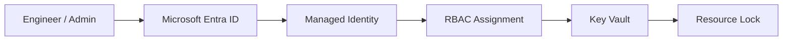
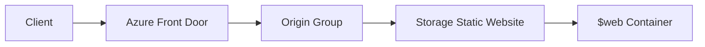
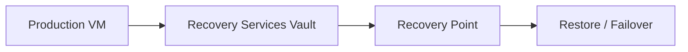

# Azure Hands-on Engineering

Identity-first Azure labs for infrastructure, governance, global delivery, and recovery.


**Five hands-on modules covering identity, compute, delivery, governance, and recovery with working code and architectural patterns.**

## Architecture at a Glance

### Identity Governance



### Global Delivery



### Business Continuity



## Lab Guide

### 01-Identity-Governance

**The Scenario**  
Build an identity-first foundation with least-privilege access, break-glass protection, managed identity, and validation.

**The Architecture/Logic**  
Microsoft Entra ID is the control plane, managed identities remove secrets, RBAC scopes access, Key Vault stores secrets, and resource locks protect critical resources.

**Prerequisites**  
Azure subscription, Entra administrative access where required, Azure CLI, and VS Code with Bicep support for the IaC parts.

**Execution**  
Use the lab walkthroughs in this track, then deploy the capstone stack:

```bash
az deployment group create --resource-group <resource-group> --template-file Identity-First/bicep/main.bicep --parameters location=eastus
```

**What I Learned**  
Identity-first design reduces credential sprawl, makes authorization auditable, and gives you a cleaner path to govern every dependent workload.

Included labs:

- [Identity Fundamentals](Identity-First/01-identity%20fundamentals.md)
- [Microsoft Entra Break-Glass & Emergency Access Accounts](Secure%20Break%E2%80%91Glass%20Accounts/1-Secure%20Break%E2%80%91Glass%20Accounts.md)
- [Managed Identity + Key Vault](Identity-First/02-managed%20Identity%20%2B%20Azure%20Key%20Vault%20%28Secretless%20Authentication%29.md)
- [Microsoft Entra Roles & RBAC](Identity-First/03-azuread-roles-rbac-scopes.md)
- [Azure Locks & Resource Policies](Identity-First/04-azurelocks-resource-policies.md)
- [Access Validation](Identity-First/05-access-validation.md)
- [Azure Monitor & Activity Logs](Identity-First/06-azuremonitor-activity-logs.md)
- [Identity-First Bicep Capstone Lab](Identity-First/07-bicep-deployment-identity-stack.md)
- [VS Code Bicep Deployment Workflow](Identity-First/vscode-deployment-workflow.md)
- [Governance Flow Diagram](Identity-First/governance-flow.md)
- [Identity-First Lessons Learned](Identity-First/lessons-learned.md)

### 02-Compute-Lifecycle

**The Scenario**  
Create, generalize, capture, and scale reusable Windows compute images.

**The Architecture/Logic**  
A base VM becomes a golden image through sysprep, then that image is validated and scaled through VMSS for repeatable fleet deployment.

**Prerequisites**  
Contributor access, a Windows VM, and enough quota to create images and scale sets.

**Execution**  
Start with a base VM and follow the image lifecycle:

```bash
az vm create --resource-group <resource-group> --name <vm-name> --image Win2019Datacenter --admin-username <admin-user>
```

**What I Learned**  
Golden images reduce drift, shorten deployment time, and make scale-out behavior predictable.

Included labs:

- [Build Base VM](Compute/1-build-base-vm.md)
- [Sysprep Azure VM](Compute/2-sysprep-vm.md)
- [Capture & Test Image](VMSS/1-capture-and-test-image.md)
- [VMSS Deployment](VMSS/2-vmss-deployment.md)

### 03-Global-Delivery

**The Scenario**  
Publish static content globally with Azure Front Door in front of an Azure Storage static website.

**The Architecture/Logic**  
Front Door handles the edge, origin health, HTTPS routing, and caching while the storage static website remains the origin of truth for site content.

**Prerequisites**  
A storage account with static website enabled, Azure Front Door Standard or Premium, and a working `curl` client for validation.

**Execution**  
Upload content and validate globally:

```bash
az storage blob upload-batch --destination '$web' --source <site-folder>
```

```bash
curl -I https://<frontdoor-endpoint>.z01.azurefd.net/
```

**What I Learned**  
Edge delivery is about more than performance; it separates global routing, caching, and origin health from the content-hosting layer.

Included lab:

- [Azure Front Door + Static Website Hosting](Azure%20Front%20Door-Static%20Website%20Hosting/Azure%20Front%20Door-Static%20Website%20Hosting%20Lab.md)

### 04-Governance-Automation

**The Scenario**  
Automatically remediate non-compliant Azure resources when they drift from policy.

**The Architecture/Logic**  
Azure Policy evaluates compliance, a managed identity performs remediation, and a remediation task closes the loop so governance is not just advisory.

**Prerequisites**  
Permission to create policy definitions and assignments, plus a subscription or scope where you can safely test non-compliant resources.

**Execution**  
This lab is portal-first, so the execution path is the guided Azure Policy walkthrough in the lab itself. Use the Policy compliance blade to verify remediation after the assignment runs.

**What I Learned**  
Policy becomes operational only when it can correct drift automatically; otherwise it is just a report.

Included lab:

- [Azure Policy Auto-Remediation](Azure%20Policy%20Auto%E2%80%91Remediation/1-Azure%20Policy%20Auto%E2%80%91Remediation.md)

### 05-Business-Continuity

**The Scenario**  
Validate backup, restore, replication, and failover patterns for directory services and workloads.

**The Architecture/Logic**  
Recovery Services vaults capture restore points, Azure Site Recovery extends them across regions, and the tests prove whether the design meets the target recovery objectives.

**Prerequisites**  
Appropriate backup or DR permissions, source workloads, target regions, and lab-safe resource groups with enough capacity.

**Execution**  
Create a recovery services vault:

```bash
az backup vault create --resource-group <resource-group> --name <vault-name>
```

**What I Learned**  
RPO and RTO are architecture choices, not after-the-fact reports, and the recovery workflow only matters if it is validated end to end.

Included labs:

- [Microsoft Entra Backup & Recovery](%20Microsoft%20Entra%20Backup%20%26%20Recovery/1-Microsoft%20Entra%20Backup%20%26%20Recovery.md)
- [Azure VM Backup](Recovery%20Services%20vaults/1-VM%20Backup%20and%20Restore%20Procedure.md)
- [Azure Site Recovery](Recovery%20Services%20vaults/2-Azure%20Site%20Recovery.md)
- [Azure Storage Replication](Recovery%20Services%20vaults/3-Azure%20storage%20replication.md)

## Quick Start

**New to the labs?** Start here:

1. [Identity Fundamentals](Identity-First/01-identity%20fundamentals.md) — Build identity-first thinking
2. [Managed Identity + Key Vault](Identity-First/02-managed%20Identity%20%2B%20Azure%20Key%20Vault%20%28Secretless%20Authentication%29.md) — Secretless authentication
3. [Identity-First Bicep Capstone](Identity-First/07-bicep-deployment-identity-stack.md) — Deploy a complete stack
4. [Azure Front Door + Static Website](Azure%20Front%20Door-Static%20Website%20Hosting/Azure%20Front%20Door-Static%20Website%20Hosting%20Lab.md) — Global delivery
5. [Azure Policy Auto-Remediation](Azure%20Policy%20Auto%E2%80%91Remediation/1-Azure%20Policy%20Auto%E2%80%91Remediation.md) — Governance automation

**Full curriculum available** in each lab's folder with 19 total modules.

## In Development

- Azure App Services with managed identity and deployment slots
- Defender for Cloud CSPM in hub-and-spoke architectures
- Azure Arc hybrid server management patterns

---

*Last updated: June 2026. Built with a focus on clean, maintainable engineering and enterprise-ready Azure patterns.*

💼 [LinkedIn](https://linkedin.com/in/nadeemkadwaikar) · 📧 nadeemkadwaikar@outlook.com · 📄 [License](LICENSE)