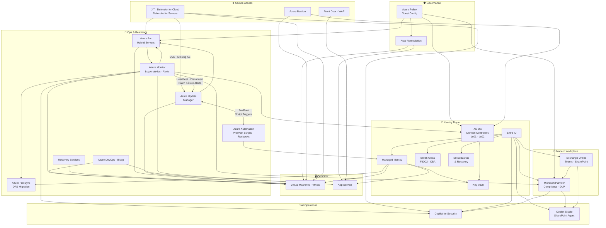

# 👋 Hi, I'm **Nadeem Kadwaikar**

Last validated on: August 2026

I build identity‑first Azure platforms that remain secure, compliant, and maintainable long after deployment. My work centres on Zero Trust, Infrastructure as Code, and production-aligned governance — the engineering patterns that keep regulated environments safe and teams unblocked. Every solution is built with [cost and security governance](Cost%20and%20Security%20Governance.md) as a design constraint, not an afterthought.

> **New here?** Start with [Identity-First](Identity-First/README.md) — every other track builds on it.
> **Jumping in?** Use the [track navigator below](#🗺️-how-to-follow-these-tracks), or go straight to the [Modern Workplace Track](Microsoft%20365/README.md) or [Architecture Overview](Architecture%20Overview.md).
> **Role-based route?** Use the [Role-Based Learning Paths](Role-Based-Learning-Paths.md) page for guided sequences and total time estimates.

---

## 👥 Who This Is Designed For

This portfolio is built for cloud engineers and identity architects evaluating production-aligned Azure engineering — specifically Zero Trust design, IaC with Bicep, and governance in regulated or enterprise environments.

| Role | What you'll find here |
| --- | --- |
| **Cloud / Platform Engineer** | End-to-end IaC (Bicep), VM lifecycle, VMSS, App Service pipelines, Arc hybrid management |
| **Identity & Security Engineer** | Zero Trust, Managed Identity, Key Vault, RBAC, Conditional Access, Break-Glass accounts, JIT |
| **Governance / Compliance Engineer** | Azure Policy + auto-remediation, Resource Locks, Purview DLP, Compliance Manager, Activity Logs |
| **Modern Workplace Engineer** | Exchange Online, Teams lifecycle, SharePoint IA, Purview, Entra ID Governance lifecycle workflows |

Need a curated start-to-finish sequence by role? See [Role-Based Learning Paths](Role-Based-Learning-Paths.md).

## 📌 Role Path Matrix

| Role | Recommended Path | Estimated Total Time | Difficulty |
| --- | --- | --- | --- |
| **Security Engineer** | [Role-Based Learning Paths](Role-Based-Learning-Paths.md#security-engineer-path) | 17.75-26.75 hours | Intermediate to Advanced |
| **Platform Engineer** | [Role-Based Learning Paths](Role-Based-Learning-Paths.md#platform-engineer-path) | 23.5-37 hours | Advanced |
| **M365 Engineer** | [Role-Based Learning Paths](Role-Based-Learning-Paths.md#m365-engineer-path) | 13-20 hours | Intermediate to Advanced |

---

## 🏗️ Featured Architecture

```mermaid
flowchart TD
    subgraph Identity["🔐 Identity Plane"]
        EntraID["Entra ID"]
        MI["Managed Identity"]
        KV["Key Vault"]
        BG["Break-Glass\nFIDO2 · CBA"]
        ADDS["AD DS\nDomain Controllers\ndc01 · dc02"]
        EntraBackup["Entra Backup\n& Recovery"]
    end
    subgraph Governance["🛡️ Governance"]
        Policy["Azure Policy\nGuest Config"]
        Remediation["Auto-Remediation"]
    end
    subgraph Access["🔒 Secure Access"]
        Bastion["Azure Bastion"]
        JIT["JIT · Defender for Cloud\nDefender for Servers"]
        AFD["Front Door · WAF"]
    end
    subgraph Compute["🖥️ Compute"]
        VM["Virtual Machines · VMSS"]
        App["App Service"]
    end
    subgraph Ops["🔄 Ops & Resilience"]
        DevOps["Azure DevOps · Bicep"]
        Monitor["Azure Monitor\nLog Analytics · Alerts"]
        Backup["Recovery Services"]
        Arc["Azure Arc\nHybrid Servers"]
        UpdateMgr["Azure Update\nManager"]
        Automation["Azure Automation\nPre/Post Scripts · Runbooks"]
        FileSync["Azure File Sync\nDFS Migration"]
    end
    subgraph M365["💼 Modern Workplace"]
        ExO["Exchange Online\nTeams · SharePoint"]
        Purview["Microsoft Purview\nCompliance · DLP"]
    end
    subgraph AI["🤖 AI Operations"]
        CfS["Copilot for Security"]
        CopilotStudio["Copilot Studio\nSharePoint Agent"]
    end

    EntraID --> MI
    EntraID --> BG
    MI --> KV
    MI --> App
    MI --> VM
    Policy --> Remediation
    Remediation --> VM & App
    Policy --> Arc
    Policy --> ADDS
    Bastion --> VM
    Bastion --> ADDS
    JIT --> VM
    JIT --> Arc
    JIT -->|"CVE · Missing KB"| UpdateMgr
    AFD --> App
    DevOps --> App
    DevOps --> VM
    Monitor --> VM & App
    Monitor --> Arc
    Monitor --> ADDS
    Monitor -->|"Heartbeat · Disconnect\nPatch Failure Alerts"| UpdateMgr
    Backup --> VM
    Arc --> VM & Monitor
    UpdateMgr --> VM & Arc
    UpdateMgr <-->|"Pre/Post\nScript Triggers"| Automation
    Automation --> MI
    ADDS --> KV
    EntraID --> EntraBackup
    MI --> FileSync
    Monitor --> FileSync
    EntraID --> ExO & Purview
    Policy --> Purview
    Monitor --> Purview
    ExO --> Purview
    Monitor --> CfS
    JIT --> CfS
    EntraID --> CfS
    Purview --> CfS
    EntraID --> CopilotStudio
    Purview --> CopilotStudio
    ExO --> CopilotStudio
```

---

## 🧠 Why This Architecture Matters

- 🔐 **Identity-first access** eliminates credential sprawl — Managed Identity + Key Vault enforce secretless authentication at every layer
- 🔄 **Windows LAPS** (GPO-based local admin password rotation) eliminates shared local administrator credentials across the server fleet — each machine carries a unique, automatically rotated password stored encrypted in Active Directory, removing a persistent lateral movement vector
- 🚫 **Zero standing access** (Bastion + JIT) removes all inbound exposure and eliminates persistent privileged sessions
- 🔑 **Break-Glass accounts** (FIDO2 + Certificate-Based Auth) guarantee emergency access without bypassing Zero Trust controls
- 🛡️ **Governance-as-code** (Azure Policy + Auto-Remediation) enforces compliance continuously across cloud and hybrid resources — no manual audits
- 🌍 **Secure public ingress** (Front Door + WAF) protects internet-facing workloads at the edge before traffic reaches the application layer
- 🏢 **AD DS in Azure** provides a production-grade domain fabric, built on Availability Sets with no public IPs and DSRM secrets sealed in Key Vault
- 🌐 **Hybrid reach via Azure Arc** extends unified policy, monitoring, and Defender for Servers to on-premises and multi-cloud workloads
- 📊 **Unified observability** (Azure Monitor + Log Analytics) surfaces alerts, patch failures, and Arc disconnect events across cloud and hybrid resources in real time
- ⚙️ **VMSS + Bicep** delivers repeatable, scalable compute through golden image pipelines and infrastructure-as-code
- 🚀 **App Service + Azure DevOps** enables zero-downtime releases via multi-stage pipelines and deployment slot promotion
- 💼 **Modern Workplace governance** (Exchange Online, Teams, SharePoint, Purview) extends Zero Trust and compliance into M365 workloads
- ♻️ **Built-in resilience** (Azure Backup, Site Recovery, VMSS failover) ensures business continuity without sacrificing security posture
- 🔁 **Identity resilience** (Entra Backup & Recovery) versions and exports identity configuration — Conditional Access policies, group memberships, role assignments — enabling controlled restore after accidental deletion or misconfiguration
- 📁 **File service continuity** (Azure File Sync + DFS migration) replaces on-premises DFS-R with cloud-tiered, monitored file shares while preserving DFS Namespace for a transparent cutover

---

## 🗺️ How to Follow These Tracks

| If you're… | Start here | What's covered |
| --- | --- | --- |
| Evaluating my architecture approach | [Architecture Overview](Architecture%20Overview.md) | High-level visual of how every component connects |
| Studying for AZ-104 or building end-to-end Azure skills | [AZ-104 Mini Enterprise Project v2](AZ-104-Mini-Enterprise-Project/AZ-104-Mini-Enterprise-Project-v2.md) | All five AZ-104 exam domains in one connected environment — Identities & Governance, Networking, Compute, Storage, Monitoring |
| Reviewing identity & Zero Trust | [Identity-First Track](Identity-First/README.md) · [Lessons Learned](Identity-First/lessons-learned.md) | Entra ID, RBAC, Conditional Access, Managed Identities, Key Vault; IaC capstone (Labs 7–8) continues in [Bicep Track](Bicep/README.md) |
| Reviewing break-glass & emergency access | [Break-Glass Accounts](Secure%20Break%E2%80%91Glass%20Accounts/README.md) | FIDO2 emergency accounts, Certificate-Based Authentication (CBA) |
| Reviewing Entra backup & recovery | [Entra Backup & Recovery](Microsoft%20Entra%20Backup%20%26%20Recovery/README.md) | Entra ID backup strategies and recovery procedures |
| Assessing identity threat detection | [Defender for Identity](Defender%20for%20Identity/README.md) | Identity attack detection for AD DS (reconnaissance, credential theft, lateral movement), sensor health, posture triage, and Defender XDR investigation workflows |
| Assessing IaC & automation | [Bicep Track](Bicep/README.md) | Modular Bicep deployments, Azure DevOps, PowerShell, Azure CLI; Bicep files validated on every PR via GitHub Actions (`az bicep build` + lint); also serves as the Labs 7–8 IaC capstone for the [Identity-First Track](Identity-First/README.md) |
| Checking governance & compliance | [Azure Policy Auto-Remediation](Azure%20Policy%20Auto%E2%80%91Remediation/README.md) | Azure Policy, Resource Locks, Activity Logs, Monitor |
| Reviewing secure access & networking | [Azure Bastion](Azure%20Bastion/README.md) · [Front Door](Azure%20Front%20Door-Static%20Website%20Hosting/README.md) | Zero standing access (Bastion — no public IPs, NSG rules, hub-spoke VNet peering), WAF and inbound exposure removal (Front Door) |
| Assessing workload protection & threat detection | [Defender for Servers](Defender%20for%20Servers/README.md) | Defender for Servers Plan 2, Arc agent health verification and reconnect/reinstall, Secure Score and recommendations (grouped vs. the emerging individual-recommendations model, fleet-scale triage via category tabs and Azure Resource Graph), vulnerability assessment (CVE scanning via MDE — no separate agent), File Integrity Monitoring (FIM), security alert investigation, Guest Configuration extension for local-policy recommendations, and Just-In-Time (JIT) VM access — covers Azure VMs and Arc-enabled servers |
| Following compute & image lifecycle | [Compute Track](Compute/README.md) · [VMSS](VMSS/README.md) | VMs, VMSS, VNets, NSGs, Load Balancers — built for resilience; Windows LAPS (native GPO-based local admin password rotation, Hybrid AD + Azure Arc) |
| Assessing App Service & DevOps pipelines | [App Service + Managed Identity](App%20Service%20%2B%20Managed%20Identity%20%2B%20Deployment%20Slots%20%2B%20Azure%20DevOps/README.md) | Deployment slots, multi-stage pipelines, secretless auth |
| Reviewing business continuity & resilience | [Recovery Services Track](Recovery%20Services%20vaults/README.md) | Azure Backup, Site Recovery, VMSS failover patterns, storage replication tiers (LRS → GZRS) |
| Exploring hybrid & Arc-enabled servers | [Azure Arc Track](Azure%20Arc%20Hybrid%20Server%20Architecture/README.md) | Arc projection, CMA onboarding, AMA + DCR monitoring, hybrid governance, Hyper-V lab |
| Assessing patch compliance & update orchestration | [Azure Update Manager](Azure%20Update%20Manager/README.md) | Patch assessment, periodic (24-hour) assessment, maintenance windows, update deployments, compliance dashboard, Updates pane (CVE/KB-centric view), Quick Alerts (ARG-backed native alerting), cross-subscription patching, hotpatching, pricing and licensing, hybrid fleet pipeline (Arc → Defender for Servers → Update Manager), patch group tagging strategy, prod vs non-prod patching strategy, Arc agent disconnect alerting, pre/post scripts, rollback, CVE-to-KB mapping, zero-day response playbook, DC staggered reboot runbook, Bicep IaC, and [Arc Server Patch Verification Toolkit](Azure%20Update%20Manager/Arc%20Server%20Patch%20Verification%20Toolkit/README.md) (enforce and verify Azure-only patching mode before configuring Update Manager) — covers Azure VMs, Arc-enabled servers, VMware vSphere (Arc), SCVMM (Arc), and Azure Local |
| Standing up AD DS in Azure | [DC in Azure Track](Deploying%20a%20Domain%20Controller%20in%20Azure/README.md) | Azure-hosted AD DS: VNet + Bastion (no public IPs), NSG AD DS rules, Availability Set, forest creation, replication, FSMO roles, Key Vault for DSRM secrets |
| Migrating file shares from DFS to Azure | [DFS to Azure File Sync](Migrate%20Distributed%20File%20System%20%28DFS%29%20to%20Azure%20File%20Sync/README.md) | DFS-R retirement, Azure File Sync deployment (Storage Sync Service, Sync Groups, server endpoint registration), DFS Namespace cutover, cloud tiering, validation and cleanup |
| Reviewing Modern Workplace (M365) | [Modern Workplace Track](Microsoft%20365/README.md) | Exchange Online, SharePoint, Teams, Purview, Zero Trust Advanced, Identity Lifecycle |
| Understanding the naming standard | [Naming Convention](Naming-Convention.md) | One consistent naming scheme across the entire portfolio |
| Assessing cloud security posture management | [Defender for Cloud CSPM](Defender%20for%20Cloud%20CSPM/README.md) | Secure Score, recommendations, and regulatory compliance — fleet-scale posture across a hub-and-spoke topology |
| Reviewing AI-assisted security operations | [Copilot for Security](Copilot%20for%20Security/README.md) | Incident summarisation, identity investigation, KQL assistance, promptbooks — Microsoft Security Copilot integrated into the SOC workflow |
| Building governed AI agents | [Copilot Studio](Copilot%20Studio/README.md) | SharePoint-grounded agent, Entra ID auth, Purview DLP, Teams publishing — applied AI on a Zero Trust foundation |

---

## 🛠️ Skills & Technology Coverage

| Domain | Technologies Demonstrated |
| --- | --- |
| **Identity & Access** | Microsoft Entra ID, Managed Identity (UAMI + SAMI), RBAC, Conditional Access, Authentication Strength, FIDO2, CBA, Privileged Identity Management, Entra ID Backup & Recovery (CA policy export, group and role assignment snapshots) |
| **Identity Threat Detection** | Microsoft Defender for Identity (sensor onboarding and health, identity alerts, posture recommendations, hybrid AD DS attack-path context) |
| **Secrets & Key Management** | Azure Key Vault (RBAC mode), secretless app authentication, Key Vault references in App Service |
| **Infrastructure as Code** | Bicep (modular, parameterised), Azure CLI, PowerShell, ARM deployment scopes |
| **Compute** | Azure Virtual Machines, VM Scale Sets, Compute Gallery, golden image pipeline (Sysprep → capture → VMSS), Windows LAPS (native GPO-based local admin password rotation, encrypted AD storage, Hybrid AD + Azure Arc) |
| **Networking & Secure Access** | Azure Bastion, JIT VM access, NSG design, VNet Peering, Azure Front Door, WAF |
| **App Delivery & DevOps** | Azure App Service, deployment slots, system-assigned Managed Identity per slot, Azure DevOps YAML pipelines, multi-stage approvals |
| **Governance & Policy** | Azure Policy (Audit, Deny, DeployIfNotExists), auto-remediation, Resource Locks, Activity Logs, KQL queries |
| **Resilience & DR** | Azure Backup, Azure Site Recovery (failover/failback), storage replication tiers (LRS → GZRS) |
| **Storage & File Services** | Azure Storage Accounts, Azure File Sync (Storage Sync Service, Sync Groups, server endpoint registration, cloud tiering), DFS Namespace and DFS-R migration (inventory → sync → namespace cutover → DFS-R retirement) |
| **Hybrid & Arc** | Azure Arc Connected Machine Agent (health verification, reconnect/reinstall), AMA + DCR, Defender for Servers, Guest Configuration, individual vs. grouped recommendations model, Update Manager |
| **Patch Management** | Azure Update Manager, periodic assessment, hotpatching, Updates pane (CVE/KB-centric view), Quick Alerts (ARG-backed), cross-subscription patching, hybrid fleet pipeline (Arc → Defender for Servers → Update Manager), maintenance configurations (staged: dev → uat → prod → dc), Arc agent disconnect alerting, pre/post scripts, CVE-to-KB mapping, zero-day response, compliance reporting, Arc Server Patch Verification Toolkit (Azure-only patching mode enforcement + verification), Azure Resource Graph KQL — Azure VMs, Arc servers, VMware vSphere (Arc), SCVMM (Arc), Azure Local |
| **Active Directory** | AD DS forest in Azure (two DCs, Availability Set, static IPs, DSRM in Key Vault, FSMO distribution) |
| **Microsoft 365** | Exchange Online, SharePoint Online, Teams lifecycle governance, Microsoft Purview (DLP, auto-labeling, Insider Risk, Compliance Manager), Zero Trust CA, Entra ID Governance lifecycle workflows |
| **AI & Security Operations** | Microsoft Security Copilot (incident summarisation, identity investigation, KQL assistance, promptbooks), Copilot Studio (SharePoint-grounded agent, Entra ID auth, Purview DLP, Teams publishing) |
| **Monitoring & Alerting** | Azure Monitor, Log Analytics Workspaces, KQL, Diagnostic Settings, Alert Rules, Action Groups, Azure Resource Graph |

---

## 💰 Cost Governance

All labs are designed to minimise Azure spend using right-sizing, auto-shutdown, scoped logging, and consumption-based services. Costs are kept predictable and low for learning environments. See the full [Cost and Security Governance](Cost%20and%20Security%20Governance.md) reference for cost optimisation practices and security non-negotiables applied across every track.

---

## 🚀 Next

What I'm building next reflects where enterprise Azure is heading — AI-augmented operations, deeper security posture management, and Copilot-native engineering — all on a Zero Trust foundation.

| Planned | Why |
| --- | --- |
| [Defender for Cloud CSPM](Defender%20for%20Cloud%20CSPM/README.md) | Extend cloud security posture management at scale across a hub-and-spoke topology, with roadmap expansion into attack path analysis and governance rules, building on the Defender for Servers foundation already covered in the [Defender for Servers track](Defender%20for%20Servers/README.md) |

---

## 💡 Engineering Philosophy

I build systems that future‑me — and future teams — can pick up without sorting through a mess.

My work is shaped by three principles:

- **Clarity** — document decisions, not just commands
- **Repeatability** — deployments that run cleanly every time
- **Secure Defaults** — identity-first, least privilege, no hardcoded credentials

---

## 🤝 Connect

- 💼 [LinkedIn](https://linkedin.com/in/nadeemkadwaikar)
- 📧 [nadeemkadwaikar@outlook.com](mailto:nadeemkadwaikar@outlook.com)

---

This repository is licensed under the [MIT License](LICENSE).
