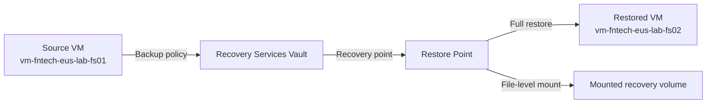

# Azure VM Backup Lab Guide

A hands-on lab covering Enhanced VM backup, file-level recovery, full VM restore, and cleanup using the current Azure Backup experience.

Navigation: [Lab Guide](../README.md) | [Next: Azure Site Recovery](2-Azure%20Site%20Recovery.md)

Last validated on: 2026-06-10
Portal experience note: Steps validated against Azure Portal UI as of June 2026; labels can vary slightly by region and feature rollout.

> **Note:** This lab uses Azure Backup defaults. Adjust retention, encryption, and security settings based on your organization’s governance and compliance requirements.

---

## Track Structure

```text
Recovery Services vaults/
|-- 1-VM Backup and Restore Procedure.md
|-- 2-Azure Site Recovery.md
`-- 3-Azure storage replication.md
```

Use this file first, then continue through Site Recovery and storage replication.

## Quick Navigation

- Track Structure
- Learning Objectives
- Prerequisites
- Lab Architecture
- Initial Setup
- Configure Backup
- Restore and Validation
- Cleanup

---

## 1. Learning Objectives

By the end of this lab, you will:

- Deploy a Recovery Services Vault
- Configure Enhanced Backup for an Azure VM
- Perform file-level recovery using the downloadable recovery executable
- Perform a full VM restore from a backup point
- Validate the restored VM
- Clean up all resources (including stopping backup)

---

## 2. Prerequisites

- Azure subscription with **Owner** or **Contributor** permissions
- Ability to create:
  - Resource groups
  - Virtual machines
  - Storage accounts
  - Recovery Services Vault

Naming reference: [README Naming Convention](../README.md#naming-convention)

### Assumptions and Scope Boundaries

- Lab uses non-production resources only.
- Private endpoints, CMK encryption, and immutability settings are out of scope.
- Cross-subscription backup and restore scenarios are out of scope.
- Production hardening (policy enforcement, lock strategy, monitoring baseline) is not covered in depth.

## Lab Architecture

Text flow: Source VM -> Recovery Services Vault -> Recovery Point -> Full VM restore and file-level restore.



---

## 3. Initial Setup

### 3.1 Create the Resource Group

1. In the Azure Portal, select **Create a resource** → **Resource group**
2. Name: `rg-fntech-eus-lab-backup`
3. Choose your subscription and region
4. Click **Review + Create** → **Create**

---

### 3.2 Create a Storage Account

1. Go to **Create a resource** → **Storage account**
2. Name: `stfntechlabbkp01`
3. Performance: Standard
4. Redundancy: Locally Redundant Storage (LRS)
5. Click **Review + Create** → **Create**

---

### 3.3 Deploy a Windows VM

1. Go to **Create a resource** → **Virtual machine**
2. Configure:
   - Name: `vm-fntech-eus-lab-fs01`
   - Resource group: `rg-fntech-eus-lab-backup`
   - Availability options: No infrastructure redundancy required
   - Security type: Standard
   - Image: Windows Server 2019 Datacenter – Gen2
   - Size: Standard_D2ds_v4 (2 vCPUs, 8 GiB RAM)
   - Configure admin credentials and networking

3. Click **Review + Create** → **Create**

---

### 3.4 Prepare the VM

1. Connect via RDP from the VM blade
2. Inside Windows:
   - Open File Explorer
   - Create folder: `C:\Data Files`
   - Add several files and subfolders (used later for recovery testing)

---

## 4. Configure Backup (New Azure Backup Experience)

Azure has redesigned the VM backup workflow. You now configure backup per VM, and during that process you either select an existing policy or create a new Enhanced policy.

> **Important:** You must select at least one VM before you can create or apply an Enhanced policy.

---

### 4.1 Start Backup from Backup Items

1. Open the **Recovery Services Vault**
2. Select **Backup items**
3. Click **Add**
4. You will enter the Configure Backup wizard

---

### 4.2 Select Backup Source

1. Where is your workload running? → **Azure**
2. What do you want to back up? → **Virtual machine**
3. Click **Backup**

---

### 4.3 Select Virtual Machines

1. Click **Add**
2. Select your VM: `vm-fntech-eus-lab-fs01`
3. Click **Select**

> You cannot proceed without selecting at least one VM.

---

### 4.4 Create or Select a Backup Policy

#### Create a New Enhanced Policy

1. Under **Backup policy**, click **Create a new policy**
2. Choose **Enhanced**
3. Enter a name: `EnhancedPolicy-VMDaily`

#### Configure Policy Details

- Full Backup
  - Backup frequency: Daily
  - Time: 8:00 AM UTC
- Instant Restore
  - Retain instant recovery snapshots: 7 days
- Retention of Daily Backup Point
  - Retain daily backup: 30 days
  - Time: 8:00 AM
- Consistency Type
  - Application or file-system consistent
- Optional Settings
  - Enable tiering (if long retention is configured)
  - Crash-consistent only (not supported for some VMs)
- Azure Backup Resource Group name
  - Prefix: `fntechnotes`
  - Suffix: `BKP`

1. Click **OK** to create the policy

---

### 4.5 Selective Disk Backup

- Azure displays all disks attached to the VM:
  - OS disk cannot be excluded
  - Data disks can be included/excluded
  - “Include future disks” can be toggled
- For this lab:
  - Include all disks
  - Include future disks: **Enabled**

---

### 4.6 Enable Backup

1. Review the Enhanced policy warning:
   - Once enabled, switching to Standard policy is not possible
2. Click **Enable backup**
   - Azure will:
     - Register the VM
     - Apply the Enhanced policy
     - Schedule the first backup

---

### 4.7 Trigger the First Backup (Updated Method)

Azure has changed how manual backups are triggered.

1. Open the **Recovery Services Vault**
2. Go to **Backup items**
3. Select **Azure Virtual Machine**
4. Locate your VM (`vm-fntech-eus-lab-fs01`)
5. Scroll horizontally to the right
6. Click the three‑dot **(…)** menu
7. Select **Backup now**
8. Choose a retention date
9. Click **OK**

---

### 4.8 Verify Backup Job Completion

1. In the vault, open **Backup Jobs**
2. Filter by your VM name (`vm-fntech-eus-lab-fs01`)
3. Confirm the latest **Backup** job status is **Completed**
4. Only proceed after completion to ensure a valid restore point is available

---

## 5. Full VM Restore Test

### 5.1 Start Full VM Restore

1. Go to **Recovery Services Vault** → **Backup items** → **Azure Virtual Machine**
2. Select your VM (`vm-fntech-eus-lab-fs01`)
3. Click **Restore VM**
4. Select a restore point from the successful backup

---

### 5.2 Configure Restore Options

1. Choose restore type:
   - **Create new virtual machine** (recommended for lab validation)

2. Configure target settings:
   - Resource group: `rg-fntech-eus-lab-backup`
   - Virtual network and subnet: use existing lab network
   - Restored VM name: `vm-fntech-eus-lab-fs02`

3. Review settings and click **Restore**

---

### 5.3 Validate Restored VM

1. Open **Backup Jobs** and wait until restore job status is **Completed**
2. Go to **Virtual machines** and confirm `vm-fntech-eus-lab-fs02` is created
3. Connect to restored VM using RDP
4. Validate expected OS state and file presence

---

### 5.4 Clean Up Restored VM (Lab)

1. If restore validation is complete, delete the restored VM and related resources created by restore
2. Keep the original VM and vault resources for file-level recovery steps below

---

## 6. File-Level Recovery Test

### 6.1 Delete Files in the VM

1. RDP into the VM
2. Delete several files/subfolders from `C:\Data Files`

---

### 6.2 Start File Recovery

1. Go to **Recovery Services Vault** → **Backup items** → **Azure Virtual Machine**
2. Select your VM
3. Click **File Recovery**
4. Select a restore point
5. Click **Download Executable** and copy the one-time password

---

### 6.3 Mount the Recovery Volume

1. Copy the `.exe` into the VM (or download directly inside the VM)
2. Run it as **Administrator**
3. Enter the password
4. Azure mounts the recovery snapshot as a read-only drive (e.g., `E:`)

---

### 6.4 Restore Deleted Files

1. Open the mounted drive
2. Navigate to: `E:\Data Files\`
3. Copy files back to: `C:\Data Files\`

---

### 6.5 Unmount the Recovery Volume

1. Return to the executable window
2. Click **Unmount Disks**
3. Close the tool and delete the EXE (optional)

---

### 6.6 Verify Recovery

- Confirm file structure and content
- Document any additional steps

---

## 7. Cleanup (Updated and Correct Order)

### 7.1 Stop Backup for the VM

1. Open the **Recovery Services Vault**
2. Go to **Backup items** → **Azure Virtual Machine**
3. Select the VM
4. Click **Stop backup**
5. Choose:
   - Stop backup and delete backup data
6. Confirm

---

### 7.2 Delete the Recovery Services Vault

1. Ensure **Backup items = 0**
2. Click **Delete**
3. Confirm

---

### 7.3 Delete the Storage Account

- Delete: `stfntechlabbkp01`

---

### 7.4 Delete the Resource Group

- Delete: `rg-fntech-eus-lab-backup`
- Delete the resource group created by Azure for storing Restore Point Collection

## Optional CLI Path (Key Steps)

```bash
# Create resource group
az group create --name rg-fntech-eus-lab-backup --location eastus

# Create Recovery Services vault
az backup vault create \
  --resource-group rg-fntech-eus-lab-backup \
  --name rsv-vmbackup-eus-lab-backup

# Enable backup for VM (example policy: DefaultPolicy)
az backup protection enable-for-vm \
  --resource-group rg-fntech-eus-lab-backup \
  --vault-name rsv-vmbackup-eus-lab-backup \
  --vm vm-fntech-eus-lab-fs01 \
  --policy-name DefaultPolicy

# Trigger on-demand backup
az backup protection backup-now \
  --resource-group rg-fntech-eus-lab-backup \
  --vault-name rsv-vmbackup-eus-lab-backup \
  --container-name "iaasvmcontainerv2;rg-fntech-eus-lab-backup;vm-fntech-eus-lab-fs01" \
  --item-name "vm-fntech-eus-lab-fs01" \
  --retain-until 2026-06-30T23:59:00Z
```

Note: Container and item names can differ by environment; confirm exact values with `az backup item list`.

## Troubleshooting

- Backup now option not visible: Open VM under Backup Items, scroll right, and use the row action menu.
- Policy creation blocked for Enhanced policy: Ensure at least one VM is selected in the backup wizard before creating policy.
- File Recovery executable fails to mount: Run as Administrator and verify one-time password has not expired.
- Restore job fails with quota or SKU issue: Choose a different size/zone for restored VM and re-run restore.
- Vault deletion blocked: Stop backup and delete backup data for all protected items first, then retry vault delete.
- Disk include/exclude confusion: OS disk cannot be excluded; validate selected data disks before enable backup.

## Evidence to Capture

- Screenshot of vault with protected VM and applied policy.
- Backup job status showing Completed with timestamp.
- Restore job status and restored VM overview.
- File-level recovery mounted drive and recovered file list.
- Cleanup proof: Backup items count = 0 and vault deletion completion.
- Notes: observed RPO/RTO, total recovery duration, and any portal variance.

---

Navigation: [Lab Guide](../README.md) | [Next: Azure Site Recovery](2-Azure%20Site%20Recovery.md)
