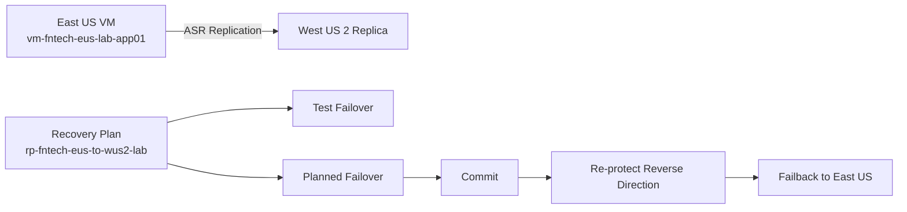

# Azure Site Recovery (ASR) Lab Guide

An East US to West US 2 disaster recovery lab.

Navigation: [Previous: Azure VM Backup](1-VM%20Backup%20and%20Restore%20Procedure.md) | [Lab Guide](../README.md) | [Next: Azure Storage Replication](3-Azure%20storage%20replication.md)

Last validated on: 2026-06-10
Portal experience note: Steps validated in Azure Portal June 2026; failover/re-protect labels may vary slightly across subscriptions.

---

## 1. Prerequisites

- Azure subscription with Contributor or Owner permissions in source and target subscriptions
- Source VM running in East US
- Target region capacity in West US 2
- Existing source resource group: rg-fntech-eus-lab-core
- Target resource group for DR resources: rg-fntech-wus2-lab-dr
- Recovery Services vault name reserved: rsv-fntech-wus2-lab-dr
- (Recommended) Existing target VNet and subnet in West US 2

Naming reference: [README Naming Convention](../README.md#naming-convention)

### Assumptions and Scope Boundaries

- Lab assumes source and DR subscriptions are available and allowed for ASR usage.
- Private endpoint architecture and custom DNS failover are out of scope.
- CMK-based encryption and advanced compliance controls are out of scope.
- Cross-subscription failback complexity and production runbook automation are out of scope.
- Production hardening (change windows, CAB approvals, and app dependency mapping) is not fully covered.

## Lab Architecture



---

## 2. Initial Setup

### 2.1 Create the Target Resource Group (DR Region)

1. In Azure Portal, go to Resource groups and select Create.
2. Use the following values:
	- Resource group name: rg-fntech-wus2-lab-dr
	- Region: West US 2
3. Select Review + create, then Create.

### 2.2 Create the Source VM (Source Region)

1. Create or reuse the source VM in East US.
2. Use resource group rg-fntech-eus-lab-core.
3. Use source VM vm-fntech-eus-lab-app01 for all steps in this lab.

### 2.3 Create the Recovery Services Vault (Target Region)

1. Search for Recovery Services vaults and select Create.
2. Use the following values:
	- Name: rsv-fntech-wus2-lab-dr
	- Resource group: rg-fntech-wus2-lab-dr
	- Region: West US 2
3. Create the vault.
4. In vault settings, enable Cross Region Restore if your lab requires it.

---

## 3. Enable Site Recovery Replication

### 3.1 Start Replication Workflow

1. Open Recovery Services vault rsv-fntech-wus2-lab-dr.
2. In the left menu, select Site Recovery.
3. Select Enable replication.

### 3.2 Configure Source

1. Set source configuration:
	- Source location: East US
	- Source resource group: rg-fntech-eus-lab-core
	- Deployment model: Resource Manager
	- Disaster recovery between availability zones: No
2. Select VM vm-fntech-eus-lab-app01.
3. Select Next.

### 3.3 Configure Target

1. Set target configuration:
	- Target location: West US 2
	- Target resource group: rg-fntech-wus2-lab-dr
	- Target VNet: vnet-fntech-wus2-lab-dr
	- Target subnet: default (10.0.0.0/24)
2. Cache storage account:
	- Use auto-created account, or select an existing one in source region.
3. Replication policy:
	- Select 24-hour-retention-policy (or your lab policy).
4. Replication group:
	- Name: asr-fntech-eus-to-wus2-lab
5. Extension settings:
	- Allow ASR to manage updates for Mobility service.
6. Select Enable replication.

### 3.4 Validate Replication Health

1. Go to Vault, Site Recovery, Replicated items.
2. Select vm-fntech-eus-lab-app01.
3. Confirm:
	- Replication health is Healthy.
	- RPO is visible.
	- Latest recovery point has a recent timestamp.
4. Record start time, latest recovery point, and RPO value.

---

## 4. Application Validation Setup

### 4.1 Install IIS on Source VM

1. Follow instructions from [../Compute/3-Install IIS.md](../Compute/3-Install%20IIS.md).

### 4.2 Allow HTTP on Source VM

1. Open the NSG attached to source VM NIC/subnet.
2. Add inbound rule:
	- Source: Any
	- Protocol: TCP
	- Destination port: 80
	- Action: Allow
	- Priority: 1000
	- Name: Allow-HTTP-80

### 4.3 Validate Source Application

1. Copy source VM public IP from VM Overview.
2. Browse to http://public-ip.
3. Confirm IIS default page is reachable.

---

## 5. Create Recovery Plan

1. Go to Vault, Site Recovery, Recovery plans.
2. Select Create recovery plan.
3. Use:
	- Name: rp-fntech-eus-to-wus2-lab
	- Source: East US
	- Target: West US 2
4. Add VM vm-fntech-eus-lab-app01.
5. Create the recovery plan.

---

## 6. Test Failover (Use Recovery Plan Only)

Important:
- Do not run Test Failover directly from Replicated items or VM blade.
- Run Test Failover from Recovery plan.

### 6.1 Run Test Failover

1. Open recovery plan rp-fntech-eus-to-wus2-lab.
2. Select Test failover.
3. Use:
	- Recovery point: Latest processed
	- Target VNet: vnet-fntech-wus2-lab-dr
4. Start test failover.

### 6.2 Validate Test VM

1. Validate test VM boot and application state.
2. If needed for access, attach NSG and Public IP manually.
3. Validate:
	- IIS response
	- Folder/file presence
	- Expected application behavior

### 6.3 Cleanup Test Failover

1. Return to recovery plan.
2. Select Cleanup test failover.
3. Choose Testing completed.
4. Confirm all test failover VMs are deleted.

---

## 7. Planned Failover (East US to West US 2)

### 7.1 Run Planned Failover

1. Open recovery plan rp-fntech-eus-to-wus2-lab.
2. Select Failover.
3. Set Recovery point to Latest processed.
4. Confirm direction is East US to West US 2.
5. Start failover.
6. Wait until the job shows Succeeded.

### 7.2 Validate DR VM

1. If you cannot connect, configure Public IP and NSG on the DR VM:
	- Open Virtual machines and select the failed over DR VM.
	- Go to Networking and open the VM network interface (NIC).
	- In IP configurations, open ipconfig1 (or primary configuration).
	- Set Public IP to Create new, name it pip-fntech-wus2-lab-vm, then Save.
	- Go back to the NIC and open Network security group.
	- Associate an existing NSG, or create nsg-fntech-wus2-lab-vm.
	- In NSG inbound rules, add:
		- Allow-RDP-3389 (TCP, port 3389, Priority 1000)
		- Allow-HTTP-80 (TCP, port 80, Priority 1010)
	- Save changes and wait 1 to 2 minutes for rule propagation.
2. Sign in to the DR VM.
3. Create this validation folder:
	- C:\DR-Folder-Test

---

### 7.3 Commit Planned Failover

1. Return to recovery plan rp-fntech-eus-to-wus2-lab.
2. Open Jobs and confirm failover status is Succeeded.
3. Select Commit for the failed over VM(s).
4. Wait until commit job is completed.

---

## 8. Failback (West US 2 to East US)

### 8.1 Re-protect Before Failback

1. In the recovery plan, select the replicated item after planned failover.
2. Select Re-protect.
3. Confirm replication direction is now West US 2 to East US.
4. Review target settings for East US resources and start re-protect.
5. Wait for replication health to return to Healthy and recovery points to appear.

This step is required so failback has valid reverse-direction replication.

---

### 8.2 Run Failback

1. In the same recovery plan, select Failover.
2. Confirm direction is West US 2 to East US.
3. Start failover.
4. Wait until the job shows Succeeded.

### 8.3 Validate Failback

1. Sign in to the East US VM.
2. Confirm:
	- C:\DR-Folder-Test exists
	- Application is reachable and working as expected

This confirms data consistency and end-to-end DR flow.

### 8.4 Commit Failback

1. In recovery plan jobs, confirm failback shows Succeeded.
2. Select Commit to finalize the East US workload as primary.
3. Wait for commit completion before cleanup or next DR cycle.

---

## 9. Cleanup

1. Delete in this order:
	- Recovery plan
	- Replicated items (disable replication)
	- Test/temporary VMs
	- NSGs and Public IPs created for testing
	- DR networking resources (if lab-only)
2. Delete Recovery Services vault after protected items and backup artifacts are removed.
3. Delete lab resource groups if no longer needed.

## Optional CLI Path (Key Steps)

```bash
# Create target DR resource group
az group create --name rg-fntech-wus2-lab-dr --location westus2

# Create Recovery Services vault
az backup vault create \
	--resource-group rg-fntech-wus2-lab-dr \
	--name rsv-fntech-wus2-lab-dr

# List fabrics and protection containers (ASR discovery)
az site-recovery fabric list \
	--resource-group rg-fntech-wus2-lab-dr \
	--vault-name rsv-fntech-wus2-lab-dr

# List replicated items (health check)
az site-recovery protected-item list \
	--resource-group rg-fntech-wus2-lab-dr \
	--vault-name rsv-fntech-wus2-lab-dr
```

Note: ASR CLI commands vary by scenario and API version. Use CLI for inventory/validation and keep failover execution in portal unless you have an automation runbook.

## Troubleshooting

- Enable replication button is disabled: Verify vault region, source VM eligibility, and required provider registration.
- Test failover fails at networking stage: Confirm target VNet/subnet exists in West US 2 and has no conflicting policy.
- Failover button unavailable in recovery plan: Ensure replication health is Healthy and at least one recent recovery point exists.
- Re-protect fails after commit: Check reverse path target settings and required DR resources in source region.
- Replication lag confusion: RPO is asynchronous; verify Latest recovery point timestamp before failover decisions.
- Vault deletion blocked: Disable replication for all protected items and remove recovery plans first.
- DR VM unreachable: Attach NSG/Public IP and confirm inbound rules for RDP/HTTP.

## Evidence to Capture

- Screenshot of replicated item health and RPO value.
- Test failover job status and cleanup completion.
- Planned failover and commit job completion timestamps.
- Re-protect and failback job completion evidence.
- DR VM validation artifacts (IIS page and `C:\DR-Folder-Test`).
- Cleanup evidence: zero protected items and vault deletion readiness.

---

Navigation: [Previous: Azure VM Backup](1-VM%20Backup%20and%20Restore%20Procedure.md) | [Lab Guide](../README.md) | [Next: Azure Storage Replication](3-Azure%20storage%20replication.md)