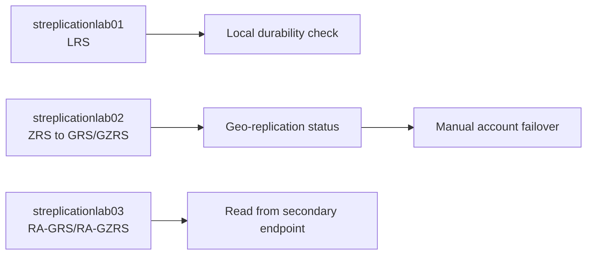

# Azure Storage Replication Lab Guide

Hands-on lab to compare Azure Storage redundancy options, validate read-access geo-replication, and perform a controlled geo-failover in a non-production environment.

Navigation: [Previous: Azure Site Recovery](2-Azure%20Site%20Recovery.md) | [Lab Index](../README.md)

Last validated on: 2026-06-10
Portal experience note: Steps validated against Azure Portal June 2026; available redundancy transition paths vary by region and account type.

---

## 1. Lab Prerequisites

- Role: Owner or Contributor on the subscription
- Tools: Azure Portal and (optional) Azure Storage Explorer
- Region planning: choose a primary region that supports ZRS/GRS/GZRS transitions for your account type
- Safety: run this only in a lab subscription and lab data set

Naming reference: [README Naming Convention](../README.md#naming-convention)

### Assumptions and Scope Boundaries

- Lab uses non-production storage accounts and disposable test data.
- Private endpoints, firewall hardening, and CMK encryption are out of scope.
- Immutable blob policies and legal hold configuration are out of scope.
- Cross-subscription disaster recovery design is out of scope.
- Production hardening and workload-specific data consistency validation are out of scope.

## Lab Architecture



### 1.1 Pre-Validation Checklist (Recommended)

1. In Azure Portal, open **Subscriptions** and confirm your active subscription.
2. Verify **Microsoft.Storage** resource provider is registered.
3. Confirm your chosen region supports the redundancy SKUs you plan to test.
4. Confirm storage account names you plan to use are globally unique.

---

## 2. Create the Resource Group

1. Go to **Resource groups** and select **+ Create**.
2. Subscription: your lab subscription.
3. Resource group name: `rg-storage-replication-lab`.
4. Region: choose your primary region (example: East US).
5. Select **Review + create** and then **Create**.

---

## 3. Create First Storage Account (LRS)

1. Go to **Storage accounts** and select **+ Create**.
2. Subscription: your lab subscription.
3. Resource group: `rg-storage-replication-lab`.
4. Storage account name: `streplicationlab01` (must be globally unique).
5. Region: same as resource group.
6. Performance: Standard.
7. Redundancy: **Locally-redundant storage (LRS)**.
8. Leave other defaults and select **Review + create** then **Create**.

---

## 4. Create a Container and Upload Test Data

1. Open storage account `streplicationlab01`.
2. Select **Data storage** -> **Containers** -> **+ Container**.
3. Name: `testdata`.
4. Public access level: **Private (no anonymous access)**.
5. Select **Create**.
6. Open `testdata` and upload a small file, such as `sample-lrs.txt`.
7. Confirm the blob appears in the container.

---

## 5. Observe LRS Characteristics

1. In `streplicationlab01`, open **Configuration**.
2. Confirm redundancy is set to **LRS**.
3. Note behavior:
	- Data is replicated within a single datacenter in one region.
	- No secondary region endpoint is available.

LRS provides the lowest cost but no zone-level or cross-region protection.

---

## 6. Create Second Storage Account (ZRS)

1. Go to **Storage accounts** and select **+ Create**.
2. Resource group: `rg-storage-replication-lab`.
3. Storage account name: `streplicationlab02`.
4. Region: one that supports ZRS and geo-zone options for your account type.
5. Performance: Standard.
6. Redundancy: **Zone-redundant storage (ZRS)**.
7. Select **Review + create** and then **Create**.

This account is used for ZRS to geo-redundancy transition testing.

---

## 7. Validate ZRS Behavior

1. Open `streplicationlab02`.
2. Confirm redundancy is **ZRS** in **Configuration**.
3. Create container `testzrs` and upload `sample-zrs.txt`.
4. Note behavior:
	- Data is replicated across availability zones in one region.
	- No regional failover endpoint is available until geo-redundancy is enabled.

---

## 8. Change Redundancy to GRS or GZRS

Not all transitions are allowed in all regions or account configurations. If a transition is blocked, capture it as a lab finding.

1. In `streplicationlab02`, open **Configuration**.
2. Under **Redundancy**, select **Upgrade** or **Change**.
3. Try one valid path based on what is available:
	- ZRS -> GZRS, or
	- ZRS -> GRS
4. Select **Save** and wait for completion.

Document:
- Which transitions were allowed.
- Which transitions were blocked and the exact portal message.
- Approximate completion time for the change.

---

## 9. Create Third Account for Read-Access Validation

A separate account keeps read-access testing independent from manual failover testing.

### 9.1 Create streplicationlab03

1. Go to **Storage accounts** and select **+ Create**.
2. Resource group: `rg-storage-replication-lab`.
3. Storage account name: `streplicationlab03`.
4. Region: same region used for `streplicationlab02`.
5. Performance: Standard.
6. Redundancy: ZRS or GZRS (whichever allows upgrade path in your region).
7. Select **Review + create** and then **Create**.

### 9.2 Enable Read-Access Geo-Replication

1. Open `streplicationlab03` and go to **Configuration**.
2. Change redundancy to one of the following:
	- **Read-access geo-zone-redundant storage (RA-GZRS)**, or
	- **Read-access geo-redundant storage (RA-GRS)**
3. Select **Save**.
4. After completion, open **Endpoints** and note:
	- Primary endpoint format: `https://<account>.blob.core.windows.net`
	- Secondary endpoint format: `https://<account>-secondary.blob.core.windows.net`

---

## 10. Validate RA-GRS or RA-GZRS Secondary Read Access

### 10.1 Using Storage Browser (Recommended)

1. Open Azure Storage Explorer (or portal storage browser).
2. Sign in with your Azure account.
3. Expand `streplicationlab03` and locate blob containers.
4. Open the secondary endpoint context if shown.
5. Confirm you can read/list blobs from the secondary endpoint.
6. Confirm write operations are not allowed against secondary.

### 10.2 Using SAS URL (Optional)

1. Generate a blob SAS with at least `Read` permission.
2. Test primary endpoint URL.
3. Replace host with `-secondary` endpoint host and test again.
4. Record result and timestamp.

Note: secondary data is asynchronously replicated and can lag behind primary writes.

---

## 11. Trigger a Manual Geo-Failover (Lab Only)

Warning: account failover is one-way and irreversible for the current direction. Perform only on lab data.

1. Use `streplicationlab02` only if redundancy is now **GRS/GZRS/RA-GRS/RA-GZRS**.
2. Open **Geo-replication**.
3. Review:
	- Primary region
	- Secondary region
	- Replication health/status
	- Last sync time (if displayed)
4. Confirm there are no locks/policies that block account updates.
5. Select **Initiate account failover**.
6. Confirm warning dialogs and proceed.

Expected behavior:
- Secondary region is promoted to primary.
- Primary endpoint continues to use same account DNS name but now serves from the new primary region.

---

## 12. Validate Post-Failover State

1. Wait for failover job to complete.
2. Reopen **Overview** and **Geo-replication**.
3. Confirm:
	- Primary region is the previous secondary region.
	- Replication status is healthy after stabilization.
4. Open container `testzrs` and confirm blob availability.
5. Download blob and verify content integrity.
6. Record observed RPO impact based on data present after failover.

---

## 13. Summary: Redundancy Selection Guide

| Type | Scope | Notes |
|---|---|---|
| LRS | Single region, single datacenter | Lowest cost; no cross-zone or cross-region protection. |
| ZRS | Single region, multi-zone | Protects against zone failure; no secondary region. |
| GRS | Cross-region | Asynchronous replication to secondary; no read access to secondary. |
| RA-GRS | Cross-region plus read | Same as GRS with readable secondary endpoint. |
| GZRS | Zone plus cross-region | Combines zone resilience with regional protection. |
| RA-GZRS | Zone plus cross-region plus read | Highest durability with readable secondary endpoint. |

---

## 14. Cleanup

1. Delete test blobs/containers to minimize ongoing storage and transaction cost.
2. Delete storage accounts:
	- `streplicationlab01`
	- `streplicationlab02`
	- `streplicationlab03`
3. Delete resource group `rg-storage-replication-lab`.
4. Confirm no locks remain that prevent resource group deletion.

## Optional CLI Path (Key Steps)

```bash
# Create lab resource group
az group create --name rg-storage-replication-lab --location eastus

# Create LRS storage account
az storage account create \
	--name streplicationlab01 \
	--resource-group rg-storage-replication-lab \
	--location eastus \
	--sku Standard_LRS

# Create ZRS storage account
az storage account create \
	--name streplicationlab02 \
	--resource-group rg-storage-replication-lab \
	--location eastus2 \
	--sku Standard_ZRS

# Check geo-replication and failover status
az storage account show \
	--name streplicationlab02 \
	--resource-group rg-storage-replication-lab \
	--query "{sku:sku.name,primary:primaryLocation,secondary:secondaryLocation,status:statusOfPrimary}"
```

Note: Redundancy transition and account failover commands can be constrained by region/account capability. Validate supported transitions in portal first.

## Troubleshooting

- Redundancy SKU not available in region: Select a supported region/account type combination for ZRS/GZRS/RA-GZRS.
- Upgrade path missing (for example ZRS to GRS): Transition rules vary; capture blocked path and use an alternative supported path.
- Secondary endpoint read test fails: Wait for replication catch-up and confirm account is RA-GRS/RA-GZRS, not GRS/GZRS only.
- Failover action disabled: Confirm account redundancy includes geo-replication and no locks/policies block updates.
- Replication lag confusion: Secondary reads are eventually consistent; validate with timestamped blob content.
- Cleanup blocked by locks: Remove resource locks at subscription/resource-group/account scope before delete.

## Evidence to Capture

- Screenshot of each storage account redundancy setting (LRS, ZRS, RA/geo).
- Proof of allowed and blocked redundancy transitions with portal messages.
- Primary and secondary endpoint test results with timestamps.
- Geo-replication status before failover and post-failover primary region.
- Blob content validation after failover.
- Cleanup evidence: deleted accounts and resource group removal success.

---

Navigation: [Previous: Azure Site Recovery](2-Azure%20Site%20Recovery.md) | [Lab Index](../README.md)
